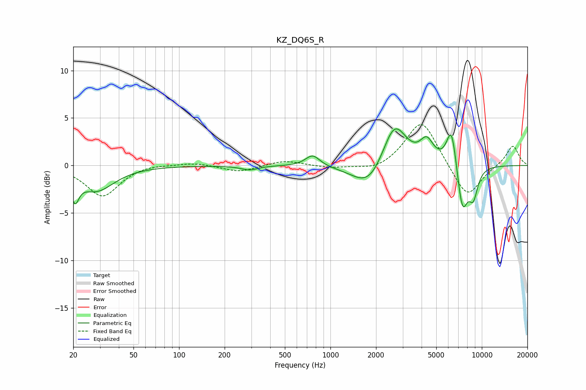

# KZ_DQ6S_R
See [usage instructions](https://github.com/jaakkopasanen/AutoEq#usage) for more options and info.

### Parametric EQs
Apply preamp of -3.9 dB when using parametric equalizer.

|   # | Type    |   Fc (Hz) |    Q |   Gain (dB) |
|-----|---------|-----------|------|-------------|
|   1 | Peaking |        21 | 5.56 |        -2.4 |
|   2 | Peaking |        28 | 1.2  |        -2.6 |
|   3 | Peaking |       292 | 2.55 |        -0.5 |
|   4 | Peaking |       763 | 2.96 |         1.2 |
|   5 | Peaking |      1798 | 1.3  |        -2.7 |
|   6 | Peaking |      2643 | 1.77 |         4.9 |
|   7 | Peaking |      4328 | 3.15 |         2.2 |
|   8 | Peaking |      6312 | 4.1  |         4.4 |
|   9 | Peaking |      7441 | 3.77 |        -5   |
|  10 | Peaking |      8782 | 4.2  |        -2.9 |

### Fixed Band EQs
When using fixed band (also called graphic) equalizer, apply preamp of **-4.4 dB** (if available) and set gains manually with these parameters.

|   # | Type    |   Fc (Hz) |    Q |   Gain (dB) |
|-----|---------|-----------|------|-------------|
|   1 | Peaking |        31 | 1.41 |        -3.3 |
|   2 | Peaking |        62 | 1.41 |         0.2 |
|   3 | Peaking |       125 | 1.41 |         0.3 |
|   4 | Peaking |       250 | 1.41 |        -0.7 |
|   5 | Peaking |       500 | 1.41 |         0.6 |
|   6 | Peaking |      1000 | 1.41 |        -0.3 |
|   7 | Peaking |      2000 | 1.41 |        -0.7 |
|   8 | Peaking |      4000 | 1.41 |         4.9 |
|   9 | Peaking |      8000 | 1.41 |        -3.6 |
|  10 | Peaking |     16000 | 1.41 |         2.2 |

### Graphs

