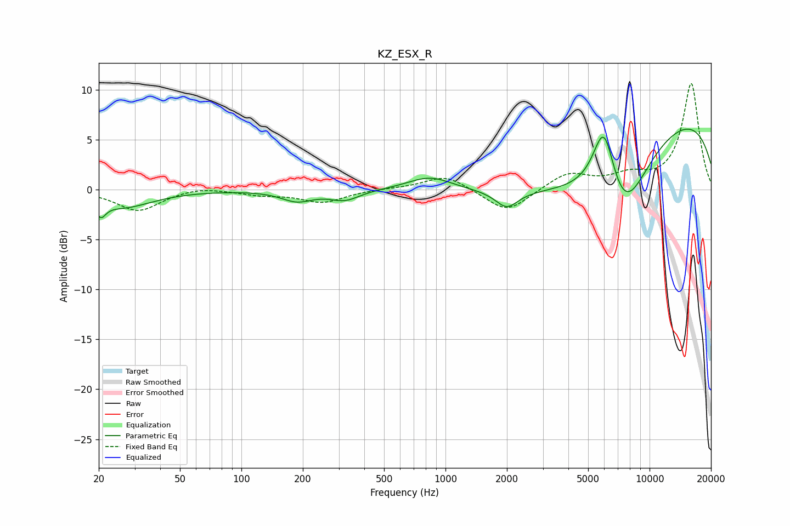

# KZ_ESX_R
See [usage instructions](https://github.com/jaakkopasanen/AutoEq#usage) for more options and info.

### Parametric EQs
Apply preamp of -6.2 dB when using parametric equalizer.

|   # | Type    |   Fc (Hz) |    Q |   Gain (dB) |
|-----|---------|-----------|------|-------------|
|   1 | Peaking |        20 | 5.94 |        -1.4 |
|   2 | Peaking |        26 | 0.96 |        -1.7 |
|   3 | Peaking |       187 | 1.83 |        -1.1 |
|   4 | Peaking |       322 | 1.95 |        -1   |
|   5 | Peaking |       839 | 1.29 |         1.4 |
|   6 | Peaking |      1997 | 2.6  |        -1.7 |
|   7 | Peaking |      4174 | 0.37 |        -6.3 |
|   8 | Peaking |      5977 | 2.42 |         7.5 |
|   9 | Peaking |      7396 | 1.16 |        -6.7 |
|  10 | Peaking |      9323 | 0.18 |         8.9 |

### Fixed Band EQs
When using fixed band (also called graphic) equalizer, apply preamp of **-10.7 dB** (if available) and set gains manually with these parameters.

|   # | Type    |   Fc (Hz) |    Q |   Gain (dB) |
|-----|---------|-----------|------|-------------|
|   1 | Peaking |        31 | 1.41 |        -2.1 |
|   2 | Peaking |        62 | 1.41 |         0.4 |
|   3 | Peaking |       125 | 1.41 |        -0.4 |
|   4 | Peaking |       250 | 1.41 |        -1.2 |
|   5 | Peaking |       500 | 1.41 |         0.1 |
|   6 | Peaking |      1000 | 1.41 |         1.5 |
|   7 | Peaking |      2000 | 1.41 |        -2.4 |
|   8 | Peaking |      4000 | 1.41 |         1.7 |
|   9 | Peaking |      8000 | 1.41 |         1.2 |
|  10 | Peaking |     16000 | 1.41 |        10.6 |

### Graphs

