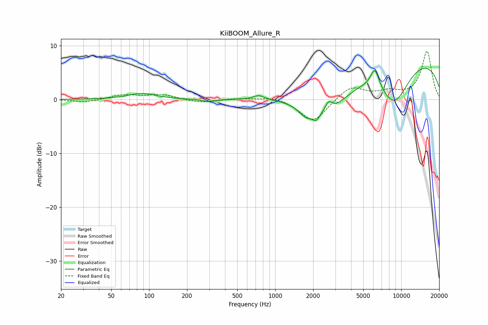

# KiiBOOM_Allure_R
See [usage instructions](https://github.com/jaakkopasanen/AutoEq#usage) for more options and info.

### Parametric EQs
Apply preamp of -5.9 dB when using parametric equalizer.

|   # | Type    |   Fc (Hz) |    Q |   Gain (dB) |
|-----|---------|-----------|------|-------------|
|   1 | Peaking |        88 | 1.31 |         1.1 |
|   2 | Peaking |       297 | 2.6  |        -0.5 |
|   3 | Peaking |       743 | 3.23 |         0.8 |
|   4 | Peaking |      1750 | 2.41 |        -2   |
|   5 | Peaking |      2117 | 5    |        -1.4 |
|   6 | Peaking |      2645 | 5.3  |         1.8 |
|   7 | Peaking |      2646 | 0.8  |        -5.5 |
|   8 | Peaking |      6178 | 4    |         3.7 |
|   9 | Peaking |      8791 | 0.99 |        -8.2 |
|  10 | Peaking |     10000 | 0.21 |         8.5 |

### Fixed Band EQs
When using fixed band (also called graphic) equalizer, apply preamp of **-9.0 dB** (if available) and set gains manually with these parameters.

|   # | Type    |   Fc (Hz) |    Q |   Gain (dB) |
|-----|---------|-----------|------|-------------|
|   1 | Peaking |        31 | 1.41 |        -0.5 |
|   2 | Peaking |        62 | 1.41 |         0.8 |
|   3 | Peaking |       125 | 1.41 |         0.9 |
|   4 | Peaking |       250 | 1.41 |        -0.6 |
|   5 | Peaking |       500 | 1.41 |         0.2 |
|   6 | Peaking |      1000 | 1.41 |         0.6 |
|   7 | Peaking |      2000 | 1.41 |        -4.3 |
|   8 | Peaking |      4000 | 1.41 |         2.5 |
|   9 | Peaking |      8000 | 1.41 |         1.2 |
|  10 | Peaking |     16000 | 1.41 |         8.9 |

### Graphs

