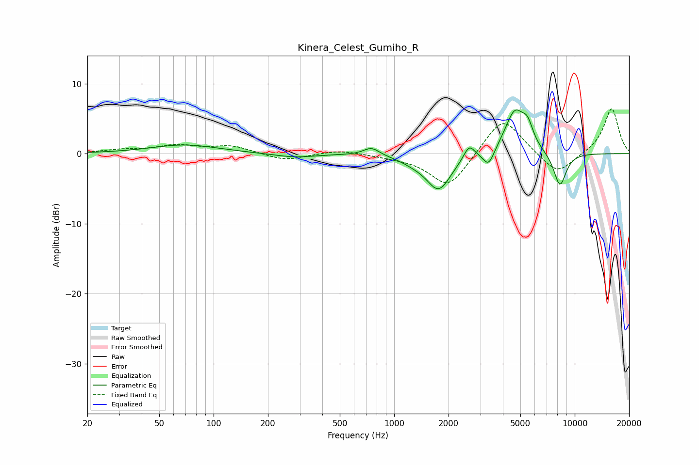

# Kinera_Celest_Gumiho_R
See [usage instructions](https://github.com/jaakkopasanen/AutoEq#usage) for more options and info.

### Parametric EQs
Apply preamp of -6.3 dB when using parametric equalizer.

|   # | Type    |   Fc (Hz) |    Q |   Gain (dB) |
|-----|---------|-----------|------|-------------|
|   1 | Peaking |        69 | 0.77 |         1.3 |
|   2 | Peaking |       281 | 1.26 |        -0.6 |
|   3 | Peaking |       749 | 3.18 |         1.2 |
|   4 | Peaking |      1275 | 1.89 |        -0.6 |
|   5 | Peaking |      1764 | 2.05 |        -5   |
|   6 | Peaking |      2601 | 4.66 |         2   |
|   7 | Peaking |      3335 | 4.51 |        -2.4 |
|   8 | Peaking |      4660 | 2.49 |         6   |
|   9 | Peaking |      5488 | 4.52 |         2.5 |
|  10 | Peaking |      8275 | 3.73 |        -4.9 |

### Fixed Band EQs
When using fixed band (also called graphic) equalizer, apply preamp of **-6.5 dB** (if available) and set gains manually with these parameters.

|   # | Type    |   Fc (Hz) |    Q |   Gain (dB) |
|-----|---------|-----------|------|-------------|
|   1 | Peaking |        31 | 1.41 |         0.5 |
|   2 | Peaking |        62 | 1.41 |         1.1 |
|   3 | Peaking |       125 | 1.41 |         1.1 |
|   4 | Peaking |       250 | 1.41 |        -1   |
|   5 | Peaking |       500 | 1.41 |         0.6 |
|   6 | Peaking |      1000 | 1.41 |        -0.3 |
|   7 | Peaking |      2000 | 1.41 |        -5   |
|   8 | Peaking |      4000 | 1.41 |         5.6 |
|   9 | Peaking |      8000 | 1.41 |        -3.2 |
|  10 | Peaking |     16000 | 1.41 |         6.5 |

### Graphs

