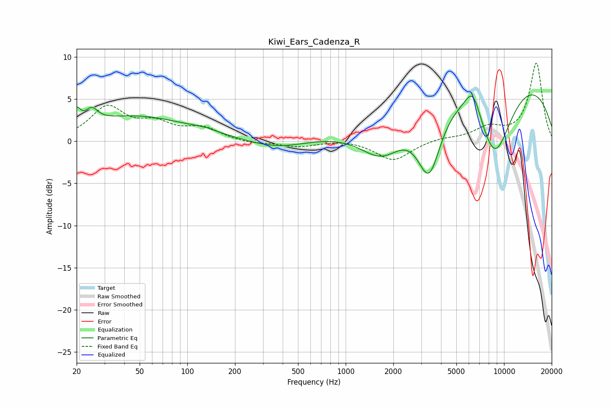

# Kiwi_Ears_Cadenza_R
See [usage instructions](https://github.com/jaakkopasanen/AutoEq#usage) for more options and info.

### Parametric EQs
Apply preamp of -5.6 dB when using parametric equalizer.

|   # | Type    |   Fc (Hz) |    Q |   Gain (dB) |
|-----|---------|-----------|------|-------------|
|   1 | Peaking |        20 | 6    |         1.8 |
|   2 | Peaking |        25 | 3.58 |         1.6 |
|   3 | Peaking |        47 | 0.43 |         2.9 |
|   4 | Peaking |       129 | 1.5  |         0.4 |
|   5 | Peaking |       371 | 0.81 |        -1   |
|   6 | Peaking |      1711 | 0.93 |        -5.5 |
|   7 | Peaking |      3365 | 1.75 |        -9   |
|   8 | Peaking |      6355 | 2.7  |         3.3 |
|   9 | Peaking |      7545 | 0.2  |        10.1 |
|  10 | Peaking |      8715 | 1.03 |       -10.8 |

### Fixed Band EQs
When using fixed band (also called graphic) equalizer, apply preamp of **-9.4 dB** (if available) and set gains manually with these parameters.

|   # | Type    |   Fc (Hz) |    Q |   Gain (dB) |
|-----|---------|-----------|------|-------------|
|   1 | Peaking |        31 | 1.41 |         3.9 |
|   2 | Peaking |        62 | 1.41 |         1.8 |
|   3 | Peaking |       125 | 1.41 |         1.4 |
|   4 | Peaking |       250 | 1.41 |        -0.3 |
|   5 | Peaking |       500 | 1.41 |        -0.6 |
|   6 | Peaking |      1000 | 1.41 |         0.2 |
|   7 | Peaking |      2000 | 1.41 |        -2.3 |
|   8 | Peaking |      4000 | 1.41 |         0.4 |
|   9 | Peaking |      8000 | 1.41 |         1.5 |
|  10 | Peaking |     16000 | 1.41 |         9.3 |

### Graphs

