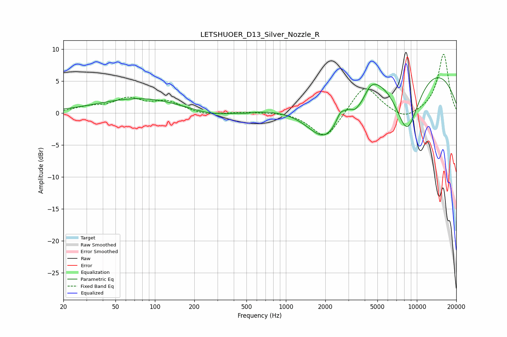

# LETSHUOER_D13_Silver_Nozzle_R
See [usage instructions](https://github.com/jaakkopasanen/AutoEq#usage) for more options and info.

### Parametric EQs
Apply preamp of -5.6 dB when using parametric equalizer.

|   # | Type    |   Fc (Hz) |    Q |   Gain (dB) |
|-----|---------|-----------|------|-------------|
|   1 | Peaking |        79 | 0.44 |         2.3 |
|   2 | Peaking |       272 | 0.83 |        -0.9 |
|   3 | Peaking |       493 | 4.33 |        -0.2 |
|   4 | Peaking |      2029 | 0.83 |       -10.1 |
|   5 | Peaking |      2600 | 5.16 |         1.1 |
|   6 | Peaking |      3365 | 4.47 |        -1.2 |
|   7 | Peaking |      3847 | 2.65 |        -2.8 |
|   8 | Peaking |      4207 | 1.95 |         2.2 |
|   9 | Peaking |      6721 | 0.2  |        10.6 |
|  10 | Peaking |      8404 | 1.17 |       -11.8 |

### Fixed Band EQs
When using fixed band (also called graphic) equalizer, apply preamp of **-9.3 dB** (if available) and set gains manually with these parameters.

|   # | Type    |   Fc (Hz) |    Q |   Gain (dB) |
|-----|---------|-----------|------|-------------|
|   1 | Peaking |        31 | 1.41 |         0.8 |
|   2 | Peaking |        62 | 1.41 |         2.1 |
|   3 | Peaking |       125 | 1.41 |         1.6 |
|   4 | Peaking |       250 | 1.41 |        -0.4 |
|   5 | Peaking |       500 | 1.41 |         0.2 |
|   6 | Peaking |      1000 | 1.41 |         0.2 |
|   7 | Peaking |      2000 | 1.41 |        -4.2 |
|   8 | Peaking |      4000 | 1.41 |         4.6 |
|   9 | Peaking |      8000 | 1.41 |        -1.3 |
|  10 | Peaking |     16000 | 1.41 |         9.3 |

### Graphs

