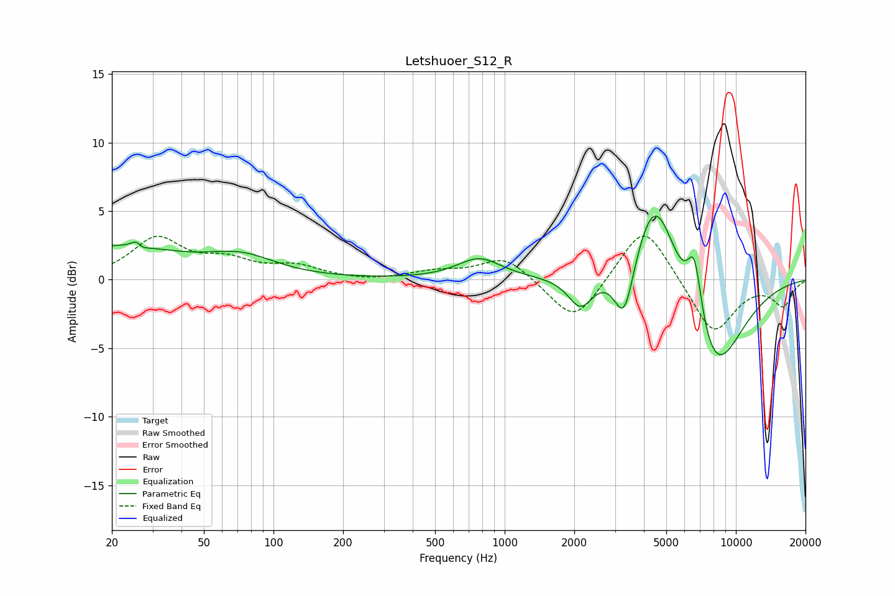

# Letshuoer_S12_R
See [usage instructions](https://github.com/jaakkopasanen/AutoEq#usage) for more options and info.

### Parametric EQs
Apply preamp of -4.7 dB when using parametric equalizer.

|   # | Type    |   Fc (Hz) |    Q |   Gain (dB) |
|-----|---------|-----------|------|-------------|
|   1 | Peaking |        20 | 0.48 |         2.3 |
|   2 | Peaking |        26 | 6    |         2.4 |
|   3 | Peaking |        26 | 5.85 |        -2.2 |
|   4 | Peaking |        73 | 0.97 |         1.3 |
|   5 | Peaking |       776 | 1.5  |         1.5 |
|   6 | Peaking |      2130 | 2.66 |        -2.3 |
|   7 | Peaking |      3289 | 3.22 |        -4.6 |
|   8 | Peaking |      4480 | 1.45 |         7.6 |
|   9 | Peaking |      6618 | 4.24 |         4.6 |
|  10 | Peaking |      8029 | 1.05 |        -7.4 |

### Fixed Band EQs
When using fixed band (also called graphic) equalizer, apply preamp of **-3.3 dB** (if available) and set gains manually with these parameters.

|   # | Type    |   Fc (Hz) |    Q |   Gain (dB) |
|-----|---------|-----------|------|-------------|
|   1 | Peaking |        31 | 1.41 |         2.9 |
|   2 | Peaking |        62 | 1.41 |         1.2 |
|   3 | Peaking |       125 | 1.41 |         0.9 |
|   4 | Peaking |       250 | 1.41 |        -0.1 |
|   5 | Peaking |       500 | 1.41 |         0.5 |
|   6 | Peaking |      1000 | 1.41 |         1.7 |
|   7 | Peaking |      2000 | 1.41 |        -3.3 |
|   8 | Peaking |      4000 | 1.41 |         4.3 |
|   9 | Peaking |      8000 | 1.41 |        -4   |
|  10 | Peaking |     16000 | 1.41 |        -1.8 |

### Graphs

