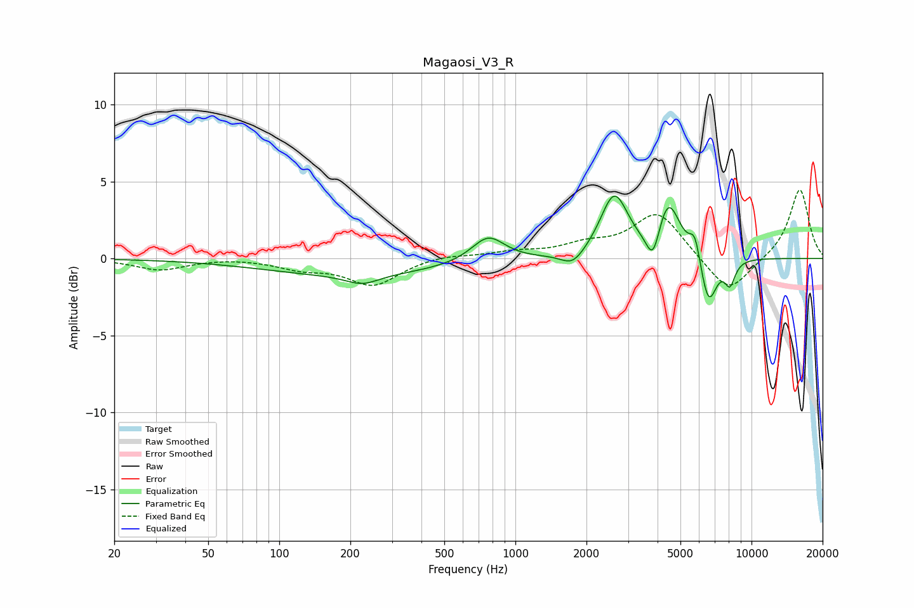

# Magaosi_V3_R
See [usage instructions](https://github.com/jaakkopasanen/AutoEq#usage) for more options and info.

### Parametric EQs
Apply preamp of -4.1 dB when using parametric equalizer.

|   # | Type    |   Fc (Hz) |    Q |   Gain (dB) |
|-----|---------|-----------|------|-------------|
|   1 | Peaking |       205 | 0.37 |        -1.1 |
|   2 | Peaking |       225 | 2.06 |        -0.6 |
|   3 | Peaking |       767 | 2.01 |         1.7 |
|   4 | Peaking |      1752 | 2.84 |        -0.9 |
|   5 | Peaking |      2623 | 2.43 |         4   |
|   6 | Peaking |      3831 | 4.81 |        -2.2 |
|   7 | Peaking |      4433 | 2.8  |         3.6 |
|   8 | Peaking |      5759 | 6    |         1.6 |
|   9 | Peaking |      6572 | 3.9  |        -3.2 |
|  10 | Peaking |      8103 | 6    |        -1.5 |

### Fixed Band EQs
When using fixed band (also called graphic) equalizer, apply preamp of **-4.5 dB** (if available) and set gains manually with these parameters.

|   # | Type    |   Fc (Hz) |    Q |   Gain (dB) |
|-----|---------|-----------|------|-------------|
|   1 | Peaking |        31 | 1.41 |        -0.7 |
|   2 | Peaking |        62 | 1.41 |         0.1 |
|   3 | Peaking |       125 | 1.41 |        -0.6 |
|   4 | Peaking |       250 | 1.41 |        -1.7 |
|   5 | Peaking |       500 | 1.41 |         0.3 |
|   6 | Peaking |      1000 | 1.41 |         0.4 |
|   7 | Peaking |      2000 | 1.41 |         0.7 |
|   8 | Peaking |      4000 | 1.41 |         3   |
|   9 | Peaking |      8000 | 1.41 |        -2.4 |
|  10 | Peaking |     16000 | 1.41 |         4.6 |

### Graphs

