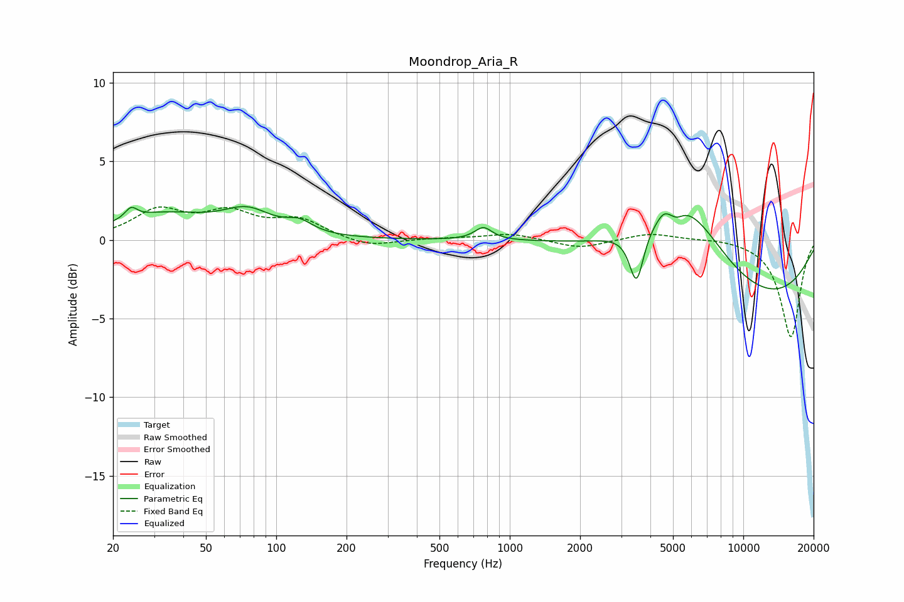

# Moondrop_Aria_R
See [usage instructions](https://github.com/jaakkopasanen/AutoEq#usage) for more options and info.

### Parametric EQs
Apply preamp of -2.2 dB when using parametric equalizer.

|   # | Type    |   Fc (Hz) |    Q |   Gain (dB) |
|-----|---------|-----------|------|-------------|
|   1 | Peaking |        24 | 5.5  |         0.7 |
|   2 | Peaking |        33 | 0.71 |         1.5 |
|   3 | Peaking |        75 | 1.35 |         1.5 |
|   4 | Peaking |       126 | 2.53 |         0.7 |
|   5 | Peaking |       771 | 3.82 |         0.8 |
|   6 | Peaking |      3491 | 4.66 |        -3.4 |
|   7 | Peaking |      4550 | 5.21 |         0.4 |
|   8 | Peaking |      5174 | 4.78 |        -0.5 |
|   9 | Peaking |      5577 | 0.79 |         5.4 |
|  10 | Peaking |     10000 | 0.3  |        -4.3 |

### Fixed Band EQs
When using fixed band (also called graphic) equalizer, apply preamp of **-2.2 dB** (if available) and set gains manually with these parameters.

|   # | Type    |   Fc (Hz) |    Q |   Gain (dB) |
|-----|---------|-----------|------|-------------|
|   1 | Peaking |        31 | 1.41 |         1.8 |
|   2 | Peaking |        62 | 1.41 |         1.5 |
|   3 | Peaking |       125 | 1.41 |         1.2 |
|   4 | Peaking |       250 | 1.41 |        -0.5 |
|   5 | Peaking |       500 | 1.41 |         0.1 |
|   6 | Peaking |      1000 | 1.41 |         0.4 |
|   7 | Peaking |      2000 | 1.41 |        -0.6 |
|   8 | Peaking |      4000 | 1.41 |         0.5 |
|   9 | Peaking |      8000 | 1.41 |         0.1 |
|  10 | Peaking |     16000 | 1.41 |        -6.2 |

### Graphs

