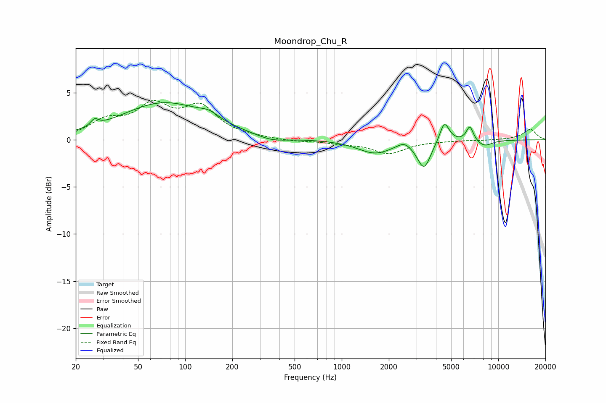

# Moondrop_Chu_R
See [usage instructions](https://github.com/jaakkopasanen/AutoEq#usage) for more options and info.

### Parametric EQs
Apply preamp of -4.0 dB when using parametric equalizer.

|   # | Type    |   Fc (Hz) |    Q |   Gain (dB) |
|-----|---------|-----------|------|-------------|
|   1 | Peaking |        26 | 6    |         0.7 |
|   2 | Peaking |        74 | 0.51 |         3.9 |
|   3 | Peaking |       142 | 2.28 |         0.7 |
|   4 | Peaking |       357 | 1.5  |        -0.5 |
|   5 | Peaking |      1629 | 1.3  |        -1.4 |
|   6 | Peaking |      2504 | 3.34 |         0.6 |
|   7 | Peaking |      3354 | 3.28 |        -2.9 |
|   8 | Peaking |      4529 | 4.55 |         2.2 |
|   9 | Peaking |      6585 | 5.99 |         1.6 |
|  10 | Peaking |      8150 | 2.65 |        -0.7 |

### Fixed Band EQs
When using fixed band (also called graphic) equalizer, apply preamp of **-4.3 dB** (if available) and set gains manually with these parameters.

|   # | Type    |   Fc (Hz) |    Q |   Gain (dB) |
|-----|---------|-----------|------|-------------|
|   1 | Peaking |        31 | 1.41 |         1.8 |
|   2 | Peaking |        62 | 1.41 |         3.3 |
|   3 | Peaking |       125 | 1.41 |         3.2 |
|   4 | Peaking |       250 | 1.41 |         0.2 |
|   5 | Peaking |       500 | 1.41 |        -0.2 |
|   6 | Peaking |      1000 | 1.41 |        -0.3 |
|   7 | Peaking |      2000 | 1.41 |        -1.4 |
|   8 | Peaking |      4000 | 1.41 |        -0.1 |
|   9 | Peaking |      8000 | 1.41 |        -0   |
|  10 | Peaking |     16000 | 1.41 |         1.1 |

### Graphs

