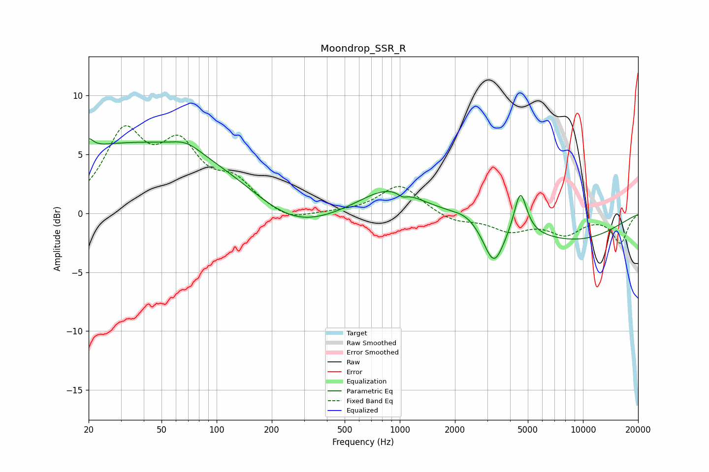

# Moondrop_SSR_R
See [usage instructions](https://github.com/jaakkopasanen/AutoEq#usage) for more options and info.

### Parametric EQs
Apply preamp of -6.4 dB when using parametric equalizer.

|   # | Type    |   Fc (Hz) |    Q |   Gain (dB) |
|-----|---------|-----------|------|-------------|
|   1 | Peaking |        20 | 5.82 |         0.8 |
|   2 | Peaking |        37 | 0.23 |         6   |
|   3 | Peaking |        68 | 1.76 |         0.8 |
|   4 | Peaking |       258 | 0.64 |        -2.3 |
|   5 | Peaking |       876 | 0.85 |         2.3 |
|   6 | Peaking |      1033 | 5.6  |        -0.4 |
|   7 | Peaking |      2292 | 2.14 |         0.4 |
|   8 | Peaking |      3263 | 2.52 |        -3.6 |
|   9 | Peaking |      4553 | 4.12 |         3.7 |
|  10 | Peaking |      8738 | 0.44 |        -2.2 |

### Fixed Band EQs
When using fixed band (also called graphic) equalizer, apply preamp of **-7.5 dB** (if available) and set gains manually with these parameters.

|   # | Type    |   Fc (Hz) |    Q |   Gain (dB) |
|-----|---------|-----------|------|-------------|
|   1 | Peaking |        31 | 1.41 |         6.4 |
|   2 | Peaking |        62 | 1.41 |         5   |
|   3 | Peaking |       125 | 1.41 |         2.3 |
|   4 | Peaking |       250 | 1.41 |        -0.8 |
|   5 | Peaking |       500 | 1.41 |         0   |
|   6 | Peaking |      1000 | 1.41 |         2.4 |
|   7 | Peaking |      2000 | 1.41 |        -0.7 |
|   8 | Peaking |      4000 | 1.41 |        -1.3 |
|   9 | Peaking |      8000 | 1.41 |        -1.6 |
|  10 | Peaking |     16000 | 1.41 |        -2.5 |

### Graphs

