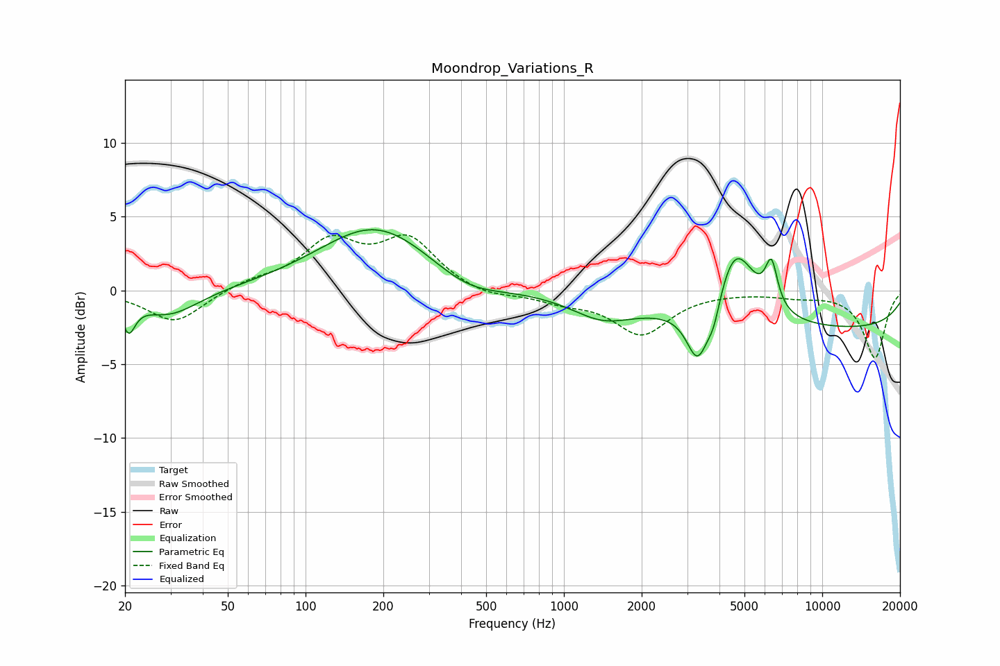

# Moondrop_Variations_R
See [usage instructions](https://github.com/jaakkopasanen/AutoEq#usage) for more options and info.

### Parametric EQs
Apply preamp of -4.2 dB when using parametric equalizer.

|   # | Type    |   Fc (Hz) |    Q |   Gain (dB) |
|-----|---------|-----------|------|-------------|
|   1 | Peaking |        21 | 5.71 |        -2   |
|   2 | Peaking |        30 | 1.21 |        -1.8 |
|   3 | Peaking |       187 | 0.65 |         4.4 |
|   4 | Peaking |       423 | 1.05 |        -1.2 |
|   5 | Peaking |      1407 | 1.17 |        -1.4 |
|   6 | Peaking |      3301 | 3.25 |        -3.9 |
|   7 | Peaking |      3808 | 5.33 |        -1.6 |
|   8 | Peaking |      4605 | 1.83 |         5.1 |
|   9 | Peaking |      6359 | 5.78 |         3   |
|  10 | Peaking |     10000 | 0.19 |        -2.6 |

### Fixed Band EQs
When using fixed band (also called graphic) equalizer, apply preamp of **-3.9 dB** (if available) and set gains manually with these parameters.

|   # | Type    |   Fc (Hz) |    Q |   Gain (dB) |
|-----|---------|-----------|------|-------------|
|   1 | Peaking |        31 | 1.41 |        -2.2 |
|   2 | Peaking |        62 | 1.41 |         0.6 |
|   3 | Peaking |       125 | 1.41 |         3.1 |
|   4 | Peaking |       250 | 1.41 |         3.3 |
|   5 | Peaking |       500 | 1.41 |        -0.5 |
|   6 | Peaking |      1000 | 1.41 |        -0.6 |
|   7 | Peaking |      2000 | 1.41 |        -2.9 |
|   8 | Peaking |      4000 | 1.41 |        -0   |
|   9 | Peaking |      8000 | 1.41 |        -0.3 |
|  10 | Peaking |     16000 | 1.41 |        -4.6 |

### Graphs

