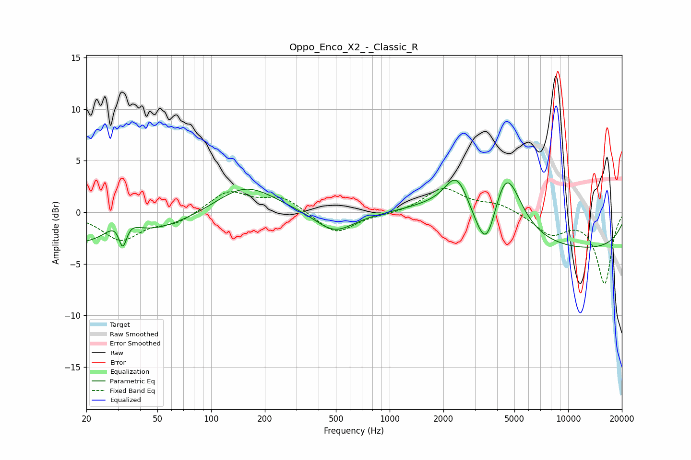

# Oppo_Enco_X2_-_Classic_R
See [usage instructions](https://github.com/jaakkopasanen/AutoEq#usage) for more options and info.

### Parametric EQs
Apply preamp of -3.2 dB when using parametric equalizer.

|   # | Type    |   Fc (Hz) |    Q |   Gain (dB) |
|-----|---------|-----------|------|-------------|
|   1 | Peaking |        21 | 0.32 |        -3.3 |
|   2 | Peaking |        32 | 2.06 |         2.7 |
|   3 | Peaking |        32 | 6    |        -3.1 |
|   4 | Peaking |       155 | 0.84 |         2.9 |
|   5 | Peaking |       491 | 1.29 |        -2.1 |
|   6 | Peaking |      1728 | 0.82 |         1.3 |
|   7 | Peaking |      2379 | 2.02 |         4   |
|   8 | Peaking |      3482 | 2.35 |        -4.9 |
|   9 | Peaking |      4471 | 1.65 |         7.1 |
|  10 | Peaking |     10000 | 0.19 |        -3.7 |

### Fixed Band EQs
When using fixed band (also called graphic) equalizer, apply preamp of **-2.4 dB** (if available) and set gains manually with these parameters.

|   # | Type    |   Fc (Hz) |    Q |   Gain (dB) |
|-----|---------|-----------|------|-------------|
|   1 | Peaking |        31 | 1.41 |        -2.6 |
|   2 | Peaking |        62 | 1.41 |        -1   |
|   3 | Peaking |       125 | 1.41 |         2.1 |
|   4 | Peaking |       250 | 1.41 |         1.4 |
|   5 | Peaking |       500 | 1.41 |        -2.2 |
|   6 | Peaking |      1000 | 1.41 |        -0.2 |
|   7 | Peaking |      2000 | 1.41 |         2.3 |
|   8 | Peaking |      4000 | 1.41 |         0.8 |
|   9 | Peaking |      8000 | 1.41 |        -2   |
|  10 | Peaking |     16000 | 1.41 |        -6.9 |

### Graphs

