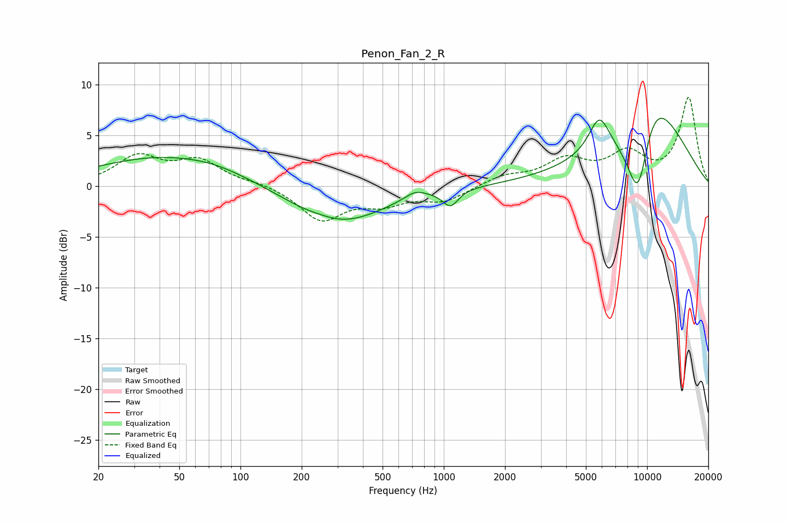

# Penon_Fan_2_R
See [usage instructions](https://github.com/jaakkopasanen/AutoEq#usage) for more options and info.

### Parametric EQs
Apply preamp of -6.8 dB when using parametric equalizer.

|   # | Type    |   Fc (Hz) |    Q |   Gain (dB) |
|-----|---------|-----------|------|-------------|
|   1 | Peaking |        45 | 0.39 |         3   |
|   2 | Peaking |        74 | 1.45 |         0.2 |
|   3 | Peaking |       250 | 1.85 |         0.3 |
|   4 | Peaking |       294 | 0.62 |        -3.9 |
|   5 | Peaking |       724 | 2.62 |         0.8 |
|   6 | Peaking |      1072 | 3.77 |         0.6 |
|   7 | Peaking |      1077 | 3.74 |        -2.2 |
|   8 | Peaking |      5818 | 2.7  |         3.5 |
|   9 | Peaking |      9058 | 1.66 |       -12.8 |
|  10 | Peaking |     10000 | 0.76 |        13.7 |

### Fixed Band EQs
When using fixed band (also called graphic) equalizer, apply preamp of **-8.8 dB** (if available) and set gains manually with these parameters.

|   # | Type    |   Fc (Hz) |    Q |   Gain (dB) |
|-----|---------|-----------|------|-------------|
|   1 | Peaking |        31 | 1.41 |         2.8 |
|   2 | Peaking |        62 | 1.41 |         2.3 |
|   3 | Peaking |       125 | 1.41 |         0.3 |
|   4 | Peaking |       250 | 1.41 |        -3.3 |
|   5 | Peaking |       500 | 1.41 |        -1.5 |
|   6 | Peaking |      1000 | 1.41 |        -1.4 |
|   7 | Peaking |      2000 | 1.41 |         0.9 |
|   8 | Peaking |      4000 | 1.41 |         2.4 |
|   9 | Peaking |      8000 | 1.41 |         2.9 |
|  10 | Peaking |     16000 | 1.41 |         8.6 |

### Graphs

