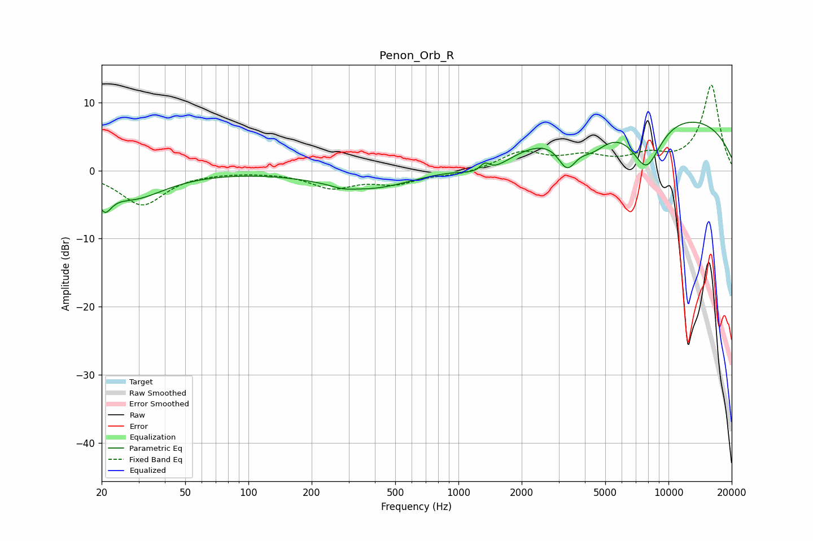

# Penon_Orb_R
See [usage instructions](https://github.com/jaakkopasanen/AutoEq#usage) for more options and info.

### Parametric EQs
Apply preamp of -7.2 dB when using parametric equalizer.

|   # | Type    |   Fc (Hz) |    Q |   Gain (dB) |
|-----|---------|-----------|------|-------------|
|   1 | Peaking |        21 | 4.42 |        -3.2 |
|   2 | Peaking |        28 | 0.92 |        -3.9 |
|   3 | Peaking |       280 | 3.06 |        -0.4 |
|   4 | Peaking |       379 | 0.66 |        -2.8 |
|   5 | Peaking |      1335 | 5.96 |         1.4 |
|   6 | Peaking |      1375 | 1.34 |        -2.6 |
|   7 | Peaking |      3293 | 3.15 |        -4.3 |
|   8 | Peaking |      4335 | 1.86 |        -3   |
|   9 | Peaking |      7839 | 1.81 |        -7.4 |
|  10 | Peaking |      8346 | 0.2  |         8.8 |

### Fixed Band EQs
When using fixed band (also called graphic) equalizer, apply preamp of **-12.6 dB** (if available) and set gains manually with these parameters.

|   # | Type    |   Fc (Hz) |    Q |   Gain (dB) |
|-----|---------|-----------|------|-------------|
|   1 | Peaking |        31 | 1.41 |        -5   |
|   2 | Peaking |        62 | 1.41 |        -0.1 |
|   3 | Peaking |       125 | 1.41 |        -0.1 |
|   4 | Peaking |       250 | 1.41 |        -2.4 |
|   5 | Peaking |       500 | 1.41 |        -1.7 |
|   6 | Peaking |      1000 | 1.41 |        -0.6 |
|   7 | Peaking |      2000 | 1.41 |         2.6 |
|   8 | Peaking |      4000 | 1.41 |         1.8 |
|   9 | Peaking |      8000 | 1.41 |         1.8 |
|  10 | Peaking |     16000 | 1.41 |        12.5 |

### Graphs

