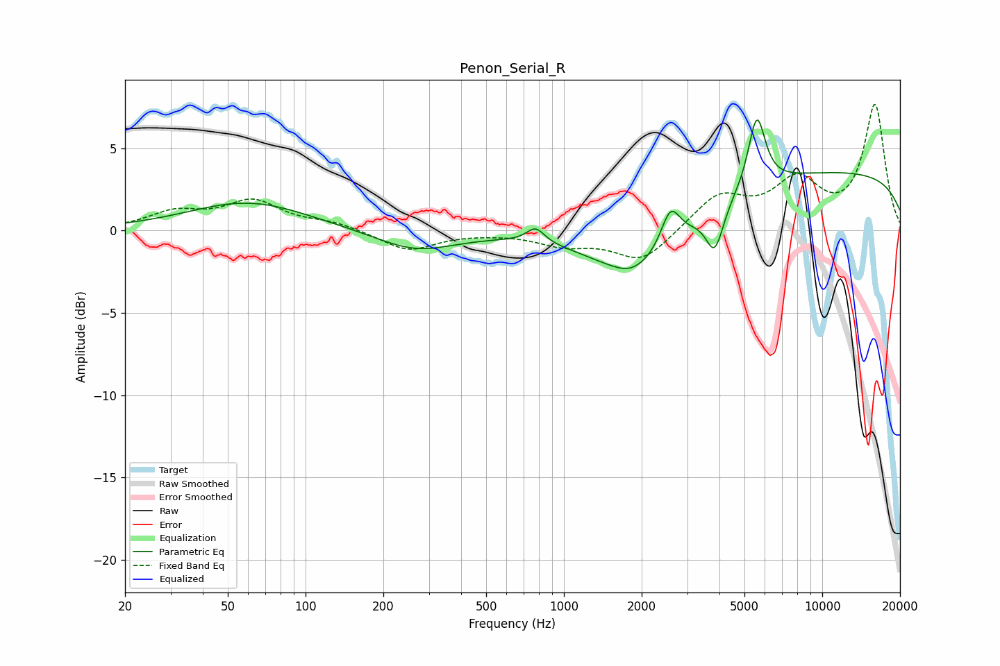

# Penon_Serial_R
See [usage instructions](https://github.com/jaakkopasanen/AutoEq#usage) for more options and info.

### Parametric EQs
Apply preamp of -6.8 dB when using parametric equalizer.

|   # | Type    |   Fc (Hz) |    Q |   Gain (dB) |
|-----|---------|-----------|------|-------------|
|   1 | Peaking |        59 | 3.61 |        -0   |
|   2 | Peaking |        60 | 0.62 |         1.8 |
|   3 | Peaking |       267 | 0.92 |        -1.2 |
|   4 | Peaking |       777 | 4.09 |         0.9 |
|   5 | Peaking |      1791 | 2.88 |        -0.2 |
|   6 | Peaking |      1971 | 0.76 |        -3.8 |
|   7 | Peaking |      2584 | 3.77 |         2.4 |
|   8 | Peaking |      3838 | 4.12 |        -2.7 |
|   9 | Peaking |      5583 | 4.26 |         4.4 |
|  10 | Peaking |     10000 | 0.18 |         3.6 |

### Fixed Band EQs
When using fixed band (also called graphic) equalizer, apply preamp of **-7.8 dB** (if available) and set gains manually with these parameters.

|   # | Type    |   Fc (Hz) |    Q |   Gain (dB) |
|-----|---------|-----------|------|-------------|
|   1 | Peaking |        31 | 1.41 |         1   |
|   2 | Peaking |        62 | 1.41 |         1.7 |
|   3 | Peaking |       125 | 1.41 |         0.4 |
|   4 | Peaking |       250 | 1.41 |        -1.2 |
|   5 | Peaking |       500 | 1.41 |        -0.1 |
|   6 | Peaking |      1000 | 1.41 |        -0.8 |
|   7 | Peaking |      2000 | 1.41 |        -1.9 |
|   8 | Peaking |      4000 | 1.41 |         2.1 |
|   9 | Peaking |      8000 | 1.41 |         2.8 |
|  10 | Peaking |     16000 | 1.41 |         7.6 |

### Graphs

