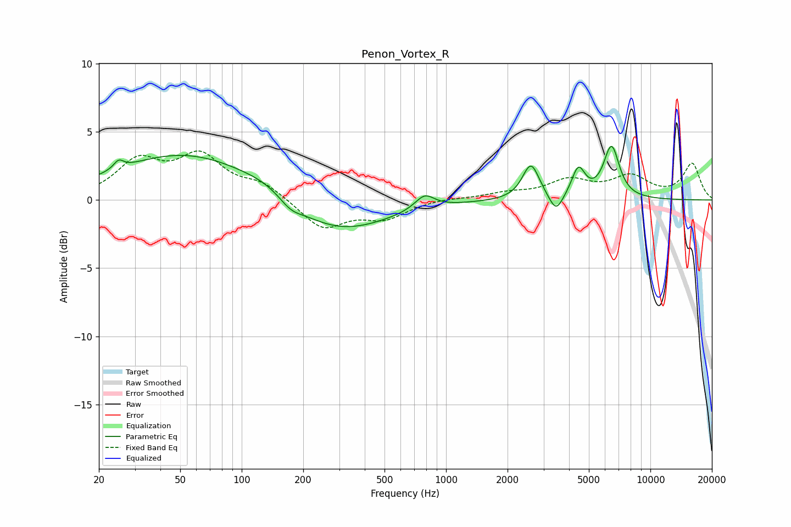

# Penon_Vortex_R
See [usage instructions](https://github.com/jaakkopasanen/AutoEq#usage) for more options and info.

### Parametric EQs
Apply preamp of -4.0 dB when using parametric equalizer.

|   # | Type    |   Fc (Hz) |    Q |   Gain (dB) |
|-----|---------|-----------|------|-------------|
|   1 | Peaking |        25 | 5.99 |         0.6 |
|   2 | Peaking |        54 | 0.41 |         3.4 |
|   3 | Peaking |       135 | 1.16 |         0.6 |
|   4 | Peaking |       173 | 2.54 |        -0.7 |
|   5 | Peaking |       288 | 0.57 |        -2.6 |
|   6 | Peaking |       786 | 2.96 |         1.1 |
|   7 | Peaking |      2602 | 3.47 |         2.6 |
|   8 | Peaking |      3456 | 4.21 |        -1.4 |
|   9 | Peaking |      4443 | 4.31 |         2.1 |
|  10 | Peaking |      6452 | 3.58 |         3.8 |

### Fixed Band EQs
When using fixed band (also called graphic) equalizer, apply preamp of **-3.7 dB** (if available) and set gains manually with these parameters.

|   # | Type    |   Fc (Hz) |    Q |   Gain (dB) |
|-----|---------|-----------|------|-------------|
|   1 | Peaking |        31 | 1.41 |         2.7 |
|   2 | Peaking |        62 | 1.41 |         3   |
|   3 | Peaking |       125 | 1.41 |         1.1 |
|   4 | Peaking |       250 | 1.41 |        -2.1 |
|   5 | Peaking |       500 | 1.41 |        -1.2 |
|   6 | Peaking |      1000 | 1.41 |         0.1 |
|   7 | Peaking |      2000 | 1.41 |         0.4 |
|   8 | Peaking |      4000 | 1.41 |         1.3 |
|   9 | Peaking |      8000 | 1.41 |         1.6 |
|  10 | Peaking |     16000 | 1.41 |         2.6 |

### Graphs

