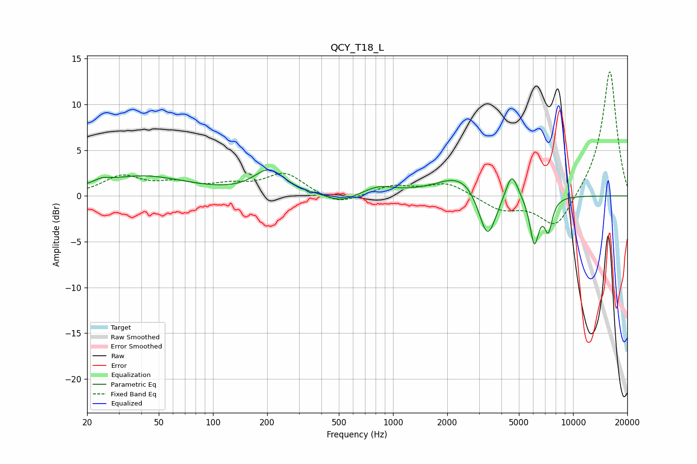

# QCY_T18_L
See [usage instructions](https://github.com/jaakkopasanen/AutoEq#usage) for more options and info.

### Parametric EQs
Apply preamp of -2.9 dB when using parametric equalizer.

|   # | Type    |   Fc (Hz) |    Q |   Gain (dB) |
|-----|---------|-----------|------|-------------|
|   1 | Peaking |        24 | 3.59 |         0.4 |
|   2 | Peaking |        40 | 0.56 |         2.1 |
|   3 | Peaking |       205 | 1.67 |         2.6 |
|   4 | Peaking |       517 | 1.72 |        -0.9 |
|   5 | Peaking |       835 | 1.65 |         0.9 |
|   6 | Peaking |      2462 | 1.05 |         2.6 |
|   7 | Peaking |      3344 | 2.75 |        -5.9 |
|   8 | Peaking |      4564 | 4.14 |         2.9 |
|   9 | Peaking |      6093 | 5.37 |        -5.2 |
|  10 | Peaking |      7283 | 5.99 |        -3.4 |

### Fixed Band EQs
When using fixed band (also called graphic) equalizer, apply preamp of **-13.7 dB** (if available) and set gains manually with these parameters.

|   # | Type    |   Fc (Hz) |    Q |   Gain (dB) |
|-----|---------|-----------|------|-------------|
|   1 | Peaking |        31 | 1.41 |         2   |
|   2 | Peaking |        62 | 1.41 |         1.2 |
|   3 | Peaking |       125 | 1.41 |         0.9 |
|   4 | Peaking |       250 | 1.41 |         2.4 |
|   5 | Peaking |       500 | 1.41 |        -1.1 |
|   6 | Peaking |      1000 | 1.41 |         1.1 |
|   7 | Peaking |      2000 | 1.41 |         1.4 |
|   8 | Peaking |      4000 | 1.41 |        -1.5 |
|   9 | Peaking |      8000 | 1.41 |        -3.8 |
|  10 | Peaking |     16000 | 1.41 |        13.9 |

### Graphs

