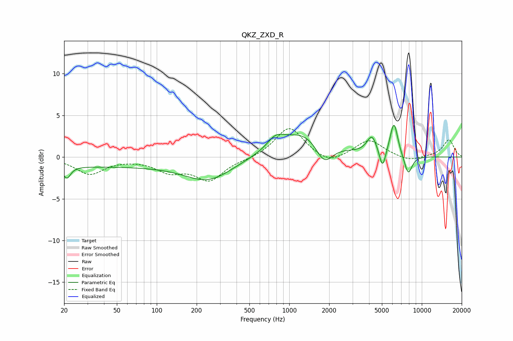

# QKZ_ZXD_R
See [usage instructions](https://github.com/jaakkopasanen/AutoEq#usage) for more options and info.

### Parametric EQs
Apply preamp of -3.9 dB when using parametric equalizer.

|   # | Type    |   Fc (Hz) |    Q |   Gain (dB) |
|-----|---------|-----------|------|-------------|
|   1 | Peaking |        21 | 5.14 |        -1.5 |
|   2 | Peaking |        35 | 0.18 |        -1.1 |
|   3 | Peaking |       247 | 0.79 |        -2.5 |
|   4 | Peaking |       787 | 2.29 |         1.3 |
|   5 | Peaking |      1326 | 0.75 |         3.2 |
|   6 | Peaking |      1831 | 2.12 |        -2.9 |
|   7 | Peaking |      4204 | 3.75 |         2.1 |
|   8 | Peaking |      5055 | 5.98 |        -2.4 |
|   9 | Peaking |      6165 | 4.68 |         4.1 |
|  10 | Peaking |      7895 | 4.37 |        -2.4 |

### Fixed Band EQs
When using fixed band (also called graphic) equalizer, apply preamp of **-3.5 dB** (if available) and set gains manually with these parameters.

|   # | Type    |   Fc (Hz) |    Q |   Gain (dB) |
|-----|---------|-----------|------|-------------|
|   1 | Peaking |        31 | 1.41 |        -2   |
|   2 | Peaking |        62 | 1.41 |        -0.1 |
|   3 | Peaking |       125 | 1.41 |        -1.5 |
|   4 | Peaking |       250 | 1.41 |        -2.7 |
|   5 | Peaking |       500 | 1.41 |        -0.2 |
|   6 | Peaking |      1000 | 1.41 |         3.7 |
|   7 | Peaking |      2000 | 1.41 |        -1   |
|   8 | Peaking |      4000 | 1.41 |         2.1 |
|   9 | Peaking |      8000 | 1.41 |        -0.6 |
|  10 | Peaking |     16000 | 1.41 |         2.1 |

### Graphs

