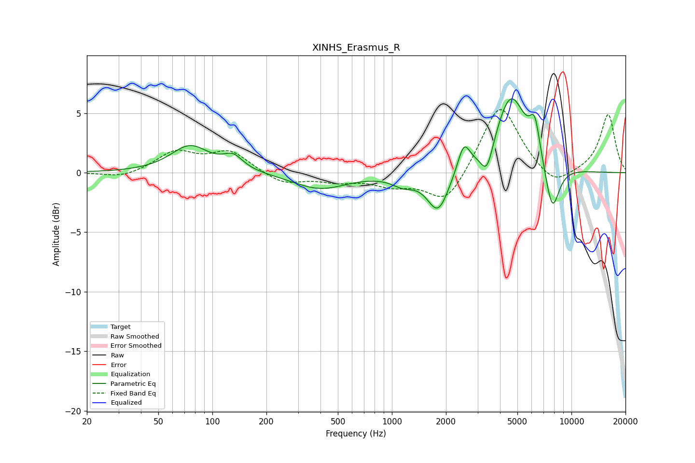

# XINHS_Erasmus_R
See [usage instructions](https://github.com/jaakkopasanen/AutoEq#usage) for more options and info.

### Parametric EQs
Apply preamp of -6.3 dB when using parametric equalizer.

|   # | Type    |   Fc (Hz) |    Q |   Gain (dB) |
|-----|---------|-----------|------|-------------|
|   1 | Peaking |        75 | 1.34 |         2.2 |
|   2 | Peaking |       131 | 2.59 |         1.1 |
|   3 | Peaking |       396 | 0.95 |        -1.4 |
|   4 | Peaking |      1156 | 2.25 |        -0.8 |
|   5 | Peaking |      1808 | 2.35 |        -3.4 |
|   6 | Peaking |      2516 | 4.17 |         2.3 |
|   7 | Peaking |      3382 | 4.11 |        -2.3 |
|   8 | Peaking |      4596 | 1.62 |         6.5 |
|   9 | Peaking |      6251 | 4.76 |         2.9 |
|  10 | Peaking |      7816 | 3.33 |        -4.1 |

### Fixed Band EQs
When using fixed band (also called graphic) equalizer, apply preamp of **-5.4 dB** (if available) and set gains manually with these parameters.

|   # | Type    |   Fc (Hz) |    Q |   Gain (dB) |
|-----|---------|-----------|------|-------------|
|   1 | Peaking |        31 | 1.41 |        -0.5 |
|   2 | Peaking |        62 | 1.41 |         1.7 |
|   3 | Peaking |       125 | 1.41 |         1.7 |
|   4 | Peaking |       250 | 1.41 |        -1   |
|   5 | Peaking |       500 | 1.41 |        -0.6 |
|   6 | Peaking |      1000 | 1.41 |        -0.9 |
|   7 | Peaking |      2000 | 1.41 |        -2.7 |
|   8 | Peaking |      4000 | 1.41 |         6   |
|   9 | Peaking |      8000 | 1.41 |        -1.4 |
|  10 | Peaking |     16000 | 1.41 |         4.9 |

### Graphs

