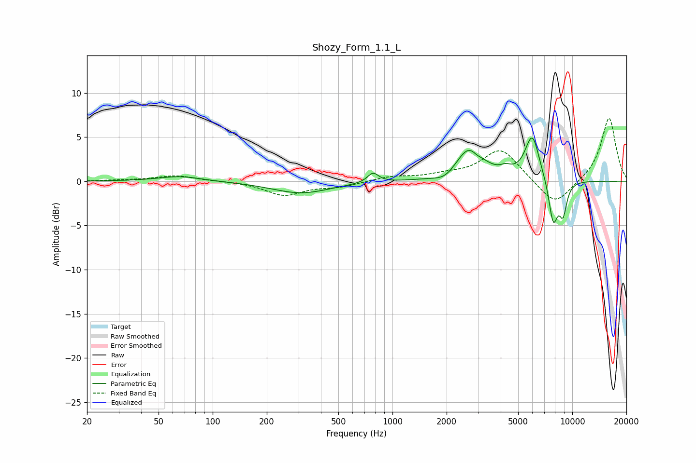

# Shozy_Form_1.1_L
See [usage instructions](https://github.com/jaakkopasanen/AutoEq#usage) for more options and info.

### Parametric EQs
Apply preamp of -5.0 dB when using parametric equalizer.

|   # | Type    |   Fc (Hz) |    Q |   Gain (dB) |
|-----|---------|-----------|------|-------------|
|   1 | Peaking |        66 | 1.19 |         0.6 |
|   2 | Peaking |       310 | 0.88 |        -1.3 |
|   3 | Peaking |       780 | 4.61 |         1.1 |
|   4 | Peaking |      1964 | 2.4  |        -0.8 |
|   5 | Peaking |      2693 | 1.85 |         3.9 |
|   6 | Peaking |      2939 | 4.87 |        -0.5 |
|   7 | Peaking |      4274 | 4.33 |         0.6 |
|   8 | Peaking |      5992 | 3.4  |         5.1 |
|   9 | Peaking |      7841 | 5.17 |        -4.9 |
|  10 | Peaking |      8884 | 6    |        -3.4 |

### Fixed Band EQs
When using fixed band (also called graphic) equalizer, apply preamp of **-7.2 dB** (if available) and set gains manually with these parameters.

|   # | Type    |   Fc (Hz) |    Q |   Gain (dB) |
|-----|---------|-----------|------|-------------|
|   1 | Peaking |        31 | 1.41 |         0.1 |
|   2 | Peaking |        62 | 1.41 |         0.6 |
|   3 | Peaking |       125 | 1.41 |         0   |
|   4 | Peaking |       250 | 1.41 |        -1.6 |
|   5 | Peaking |       500 | 1.41 |        -0.6 |
|   6 | Peaking |      1000 | 1.41 |         0.5 |
|   7 | Peaking |      2000 | 1.41 |         0.5 |
|   8 | Peaking |      4000 | 1.41 |         3.7 |
|   9 | Peaking |      8000 | 1.41 |        -3   |
|  10 | Peaking |     16000 | 1.41 |         7.3 |

### Graphs

