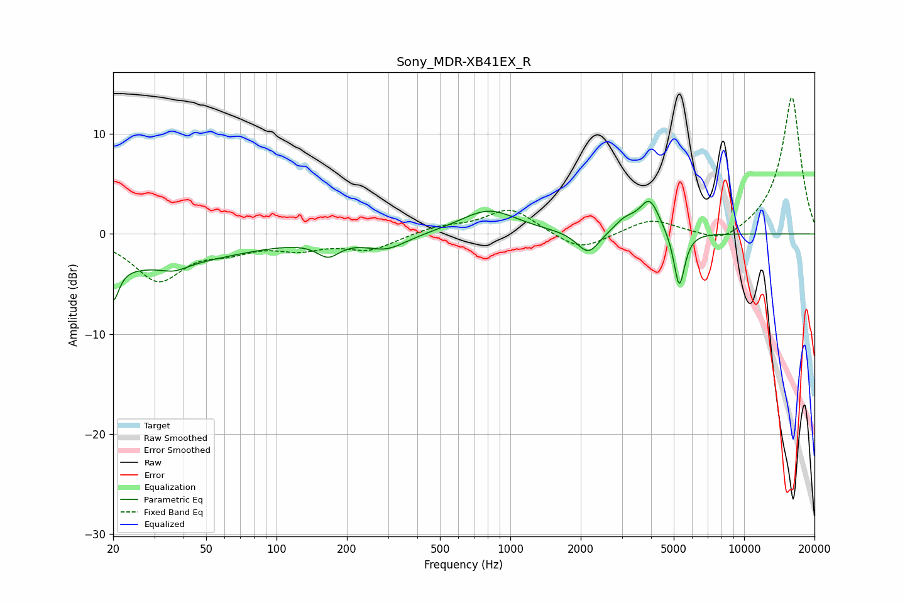

# Sony_MDR-XB41EX_R
See [usage instructions](https://github.com/jaakkopasanen/AutoEq#usage) for more options and info.

### Parametric EQs
Apply preamp of -3.4 dB when using parametric equalizer.

|   # | Type    |   Fc (Hz) |    Q |   Gain (dB) |
|-----|---------|-----------|------|-------------|
|   1 | Peaking |        20 | 5.89 |        -3.4 |
|   2 | Peaking |        24 | 0.33 |        -3.2 |
|   3 | Peaking |        37 | 2.68 |        -0.6 |
|   4 | Peaking |       166 | 2.9  |        -1.5 |
|   5 | Peaking |       295 | 1.59 |        -1.4 |
|   6 | Peaking |       808 | 1.16 |         2.4 |
|   7 | Peaking |      2155 | 2.95 |        -2.3 |
|   8 | Peaking |      3101 | 2.86 |         1.2 |
|   9 | Peaking |      3945 | 3.31 |         3.3 |
|  10 | Peaking |      5280 | 6    |        -5.7 |

### Fixed Band EQs
When using fixed band (also called graphic) equalizer, apply preamp of **-13.8 dB** (if available) and set gains manually with these parameters.

|   # | Type    |   Fc (Hz) |    Q |   Gain (dB) |
|-----|---------|-----------|------|-------------|
|   1 | Peaking |        31 | 1.41 |        -4.5 |
|   2 | Peaking |        62 | 1.41 |        -1.3 |
|   3 | Peaking |       125 | 1.41 |        -1.2 |
|   4 | Peaking |       250 | 1.41 |        -1.5 |
|   5 | Peaking |       500 | 1.41 |         0.7 |
|   6 | Peaking |      1000 | 1.41 |         2.6 |
|   7 | Peaking |      2000 | 1.41 |        -1.8 |
|   8 | Peaking |      4000 | 1.41 |         1.5 |
|   9 | Peaking |      8000 | 1.41 |        -1.3 |
|  10 | Peaking |     16000 | 1.41 |        13.8 |

### Graphs

