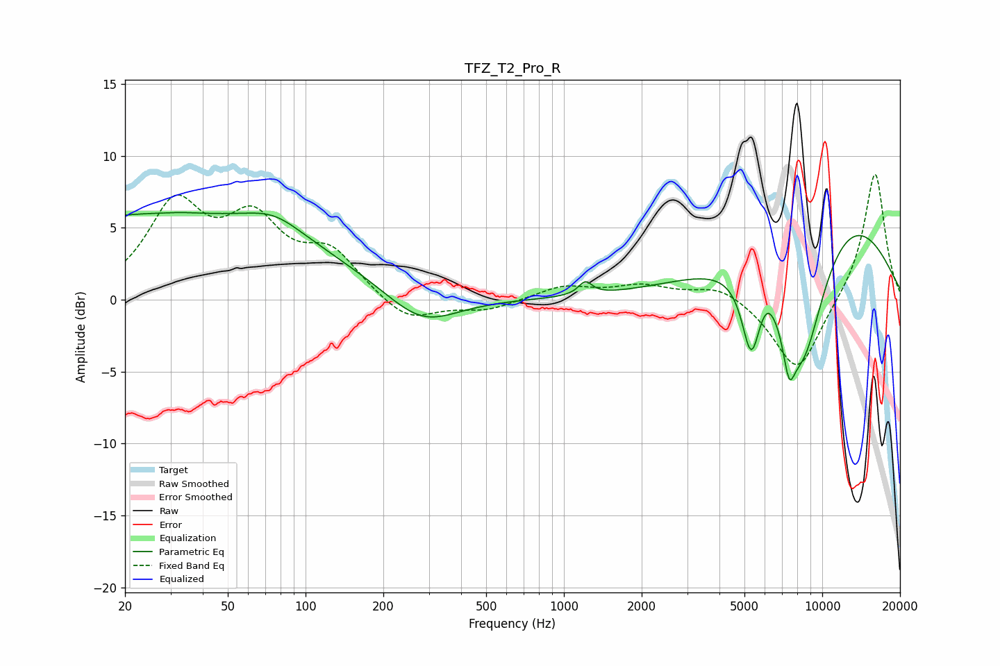

# TFZ_T2_Pro_R
See [usage instructions](https://github.com/jaakkopasanen/AutoEq#usage) for more options and info.

### Parametric EQs
Apply preamp of -6.2 dB when using parametric equalizer.

|   # | Type    |   Fc (Hz) |    Q |   Gain (dB) |
|-----|---------|-----------|------|-------------|
|   1 | Peaking |        27 | 0.19 |         5.9 |
|   2 | Peaking |        33 | 5.26 |         0   |
|   3 | Peaking |        76 | 1.31 |         1.2 |
|   4 | Peaking |       281 | 1.01 |        -2.4 |
|   5 | Peaking |      1211 | 5.43 |         0.9 |
|   6 | Peaking |      5308 | 3.89 |        -5.3 |
|   7 | Peaking |      6080 | 3.56 |         1   |
|   8 | Peaking |      7440 | 5.78 |        -2.9 |
|   9 | Peaking |      8375 | 1.21 |       -11.5 |
|  10 | Peaking |     10000 | 0.4  |         8.6 |

### Fixed Band EQs
When using fixed band (also called graphic) equalizer, apply preamp of **-8.8 dB** (if available) and set gains manually with these parameters.

|   # | Type    |   Fc (Hz) |    Q |   Gain (dB) |
|-----|---------|-----------|------|-------------|
|   1 | Peaking |        31 | 1.41 |         6.3 |
|   2 | Peaking |        62 | 1.41 |         4.8 |
|   3 | Peaking |       125 | 1.41 |         3   |
|   4 | Peaking |       250 | 1.41 |        -1.7 |
|   5 | Peaking |       500 | 1.41 |        -0.7 |
|   6 | Peaking |      1000 | 1.41 |         0.9 |
|   7 | Peaking |      2000 | 1.41 |         0.9 |
|   8 | Peaking |      4000 | 1.41 |         1.1 |
|   9 | Peaking |      8000 | 1.41 |        -5.2 |
|  10 | Peaking |     16000 | 1.41 |         9   |

### Graphs

