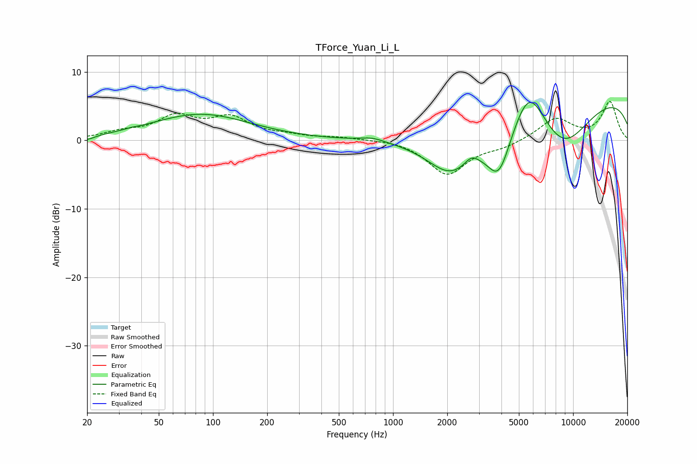

# TForce_Yuan_Li_L
See [usage instructions](https://github.com/jaakkopasanen/AutoEq#usage) for more options and info.

### Parametric EQs
Apply preamp of -5.6 dB when using parametric equalizer.

|   # | Type    |   Fc (Hz) |    Q |   Gain (dB) |
|-----|---------|-----------|------|-------------|
|   1 | Peaking |        20 | 3.46 |        -0.6 |
|   2 | Peaking |        35 | 4.88 |         0.1 |
|   3 | Peaking |        85 | 0.52 |         3.8 |
|   4 | Peaking |       767 | 2.19 |         0.6 |
|   5 | Peaking |      2109 | 0.96 |        -7   |
|   6 | Peaking |      2724 | 3.94 |         1.1 |
|   7 | Peaking |      3870 | 1.95 |        -7.7 |
|   8 | Peaking |      5689 | 1.54 |         6.6 |
|   9 | Peaking |      8732 | 0.78 |        -7.9 |
|  10 | Peaking |      9977 | 0.18 |         7.3 |

### Fixed Band EQs
When using fixed band (also called graphic) equalizer, apply preamp of **-5.8 dB** (if available) and set gains manually with these parameters.

|   # | Type    |   Fc (Hz) |    Q |   Gain (dB) |
|-----|---------|-----------|------|-------------|
|   1 | Peaking |        31 | 1.41 |         1   |
|   2 | Peaking |        62 | 1.41 |         3.2 |
|   3 | Peaking |       125 | 1.41 |         3   |
|   4 | Peaking |       250 | 1.41 |         0.5 |
|   5 | Peaking |       500 | 1.41 |         0.4 |
|   6 | Peaking |      1000 | 1.41 |         0.2 |
|   7 | Peaking |      2000 | 1.41 |        -5   |
|   8 | Peaking |      4000 | 1.41 |        -0.9 |
|   9 | Peaking |      8000 | 1.41 |         3.2 |
|  10 | Peaking |     16000 | 1.41 |         5.6 |

### Graphs

