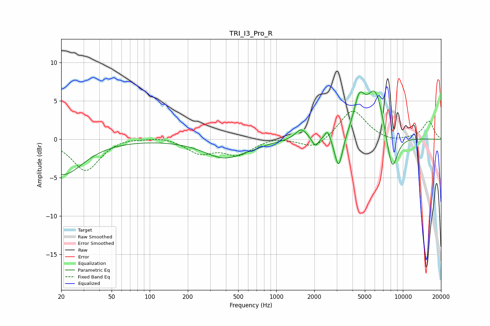

# TRI_I3_Pro_R
See [usage instructions](https://github.com/jaakkopasanen/AutoEq#usage) for more options and info.

### Parametric EQs
Apply preamp of -6.4 dB when using parametric equalizer.

|   # | Type    |   Fc (Hz) |    Q |   Gain (dB) |
|-----|---------|-----------|------|-------------|
|   1 | Peaking |        21 | 0.89 |        -4.6 |
|   2 | Peaking |       393 | 0.87 |        -2.4 |
|   3 | Peaking |       679 | 2.41 |        -0.2 |
|   4 | Peaking |      1573 | 3.1  |         1.5 |
|   5 | Peaking |      2035 | 5.67 |        -1.2 |
|   6 | Peaking |      2545 | 6    |         1.4 |
|   7 | Peaking |      3110 | 4.42 |        -4.5 |
|   8 | Peaking |      4523 | 3.26 |         4.2 |
|   9 | Peaking |      6068 | 1.95 |         6.5 |
|  10 | Peaking |      8201 | 2.89 |        -5.5 |

### Fixed Band EQs
When using fixed band (also called graphic) equalizer, apply preamp of **-3.8 dB** (if available) and set gains manually with these parameters.

|   # | Type    |   Fc (Hz) |    Q |   Gain (dB) |
|-----|---------|-----------|------|-------------|
|   1 | Peaking |        31 | 1.41 |        -4.1 |
|   2 | Peaking |        62 | 1.41 |         0.3 |
|   3 | Peaking |       125 | 1.41 |         0.4 |
|   4 | Peaking |       250 | 1.41 |        -1.7 |
|   5 | Peaking |       500 | 1.41 |        -1.9 |
|   6 | Peaking |      1000 | 1.41 |         0.4 |
|   7 | Peaking |      2000 | 1.41 |        -1.4 |
|   8 | Peaking |      4000 | 1.41 |         3.9 |
|   9 | Peaking |      8000 | 1.41 |        -0.4 |
|  10 | Peaking |     16000 | 1.41 |         2.4 |

### Graphs

