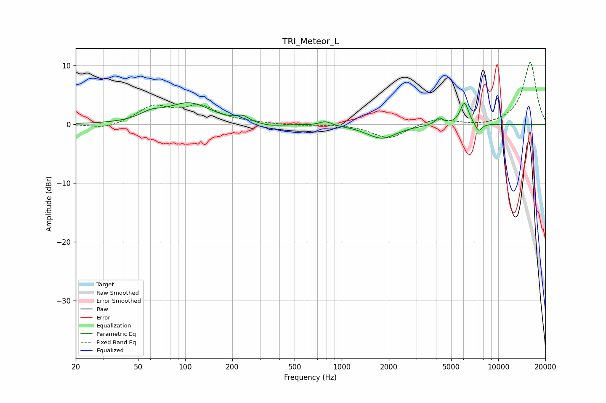

# TRI_Meteor_L
See [usage instructions](https://github.com/jaakkopasanen/AutoEq#usage) for more options and info.

### Parametric EQs
Apply preamp of -3.8 dB when using parametric equalizer.

|   # | Type    |   Fc (Hz) |    Q |   Gain (dB) |
|-----|---------|-----------|------|-------------|
|   1 | Peaking |        60 | 2.03 |         1.2 |
|   2 | Peaking |       106 | 1.03 |         3.5 |
|   3 | Peaking |       233 | 3.75 |         0.9 |
|   4 | Peaking |       345 | 1.72 |        -0.5 |
|   5 | Peaking |       721 | 2.02 |        -0.1 |
|   6 | Peaking |       787 | 3.86 |         0.7 |
|   7 | Peaking |      1798 | 1.48 |        -2.4 |
|   8 | Peaking |      4194 | 5.54 |         1.2 |
|   9 | Peaking |      6080 | 5.1  |         3.8 |
|  10 | Peaking |      7487 | 6    |        -1.5 |

### Fixed Band EQs
When using fixed band (also called graphic) equalizer, apply preamp of **-10.7 dB** (if available) and set gains manually with these parameters.

|   # | Type    |   Fc (Hz) |    Q |   Gain (dB) |
|-----|---------|-----------|------|-------------|
|   1 | Peaking |        31 | 1.41 |        -0.9 |
|   2 | Peaking |        62 | 1.41 |         2.9 |
|   3 | Peaking |       125 | 1.41 |         2.8 |
|   4 | Peaking |       250 | 1.41 |         0.2 |
|   5 | Peaking |       500 | 1.41 |        -0.2 |
|   6 | Peaking |      1000 | 1.41 |         0.1 |
|   7 | Peaking |      2000 | 1.41 |        -2.4 |
|   8 | Peaking |      4000 | 1.41 |         1.1 |
|   9 | Peaking |      8000 | 1.41 |        -0.4 |
|  10 | Peaking |     16000 | 1.41 |        10.6 |

### Graphs

