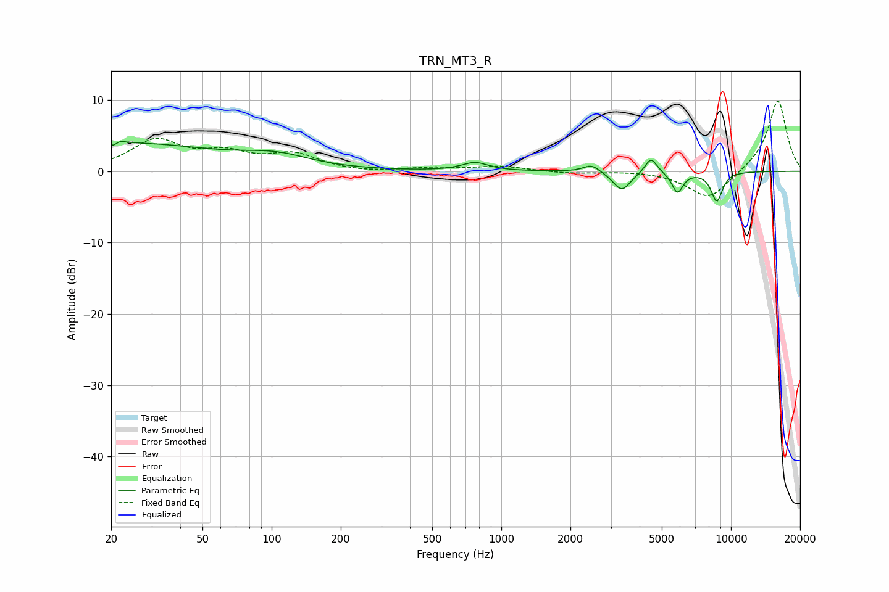

# TRN_MT3_R
See [usage instructions](https://github.com/jaakkopasanen/AutoEq#usage) for more options and info.

### Parametric EQs
Apply preamp of -4.3 dB when using parametric equalizer.

|   # | Type    |   Fc (Hz) |    Q |   Gain (dB) |
|-----|---------|-----------|------|-------------|
|   1 | Peaking |        21 | 6    |        -3.2 |
|   2 | Peaking |        21 | 5.93 |         3.1 |
|   3 | Peaking |        21 | 0.32 |         3.9 |
|   4 | Peaking |       105 | 0.99 |         1.5 |
|   5 | Peaking |       768 | 2.54 |         1.2 |
|   6 | Peaking |      2473 | 3.99 |         1.1 |
|   7 | Peaking |      3347 | 3.68 |        -2.7 |
|   8 | Peaking |      4486 | 5.32 |         2.2 |
|   9 | Peaking |      5850 | 5.7  |        -2.9 |
|  10 | Peaking |      8675 | 5.15 |        -4.1 |

### Fixed Band EQs
When using fixed band (also called graphic) equalizer, apply preamp of **-9.9 dB** (if available) and set gains manually with these parameters.

|   # | Type    |   Fc (Hz) |    Q |   Gain (dB) |
|-----|---------|-----------|------|-------------|
|   1 | Peaking |        31 | 1.41 |         4.1 |
|   2 | Peaking |        62 | 1.41 |         2.1 |
|   3 | Peaking |       125 | 1.41 |         2.2 |
|   4 | Peaking |       250 | 1.41 |        -0.2 |
|   5 | Peaking |       500 | 1.41 |         0.4 |
|   6 | Peaking |      1000 | 1.41 |         0.7 |
|   7 | Peaking |      2000 | 1.41 |        -0.3 |
|   8 | Peaking |      4000 | 1.41 |         0.1 |
|   9 | Peaking |      8000 | 1.41 |        -4   |
|  10 | Peaking |     16000 | 1.41 |        10.1 |

### Graphs

