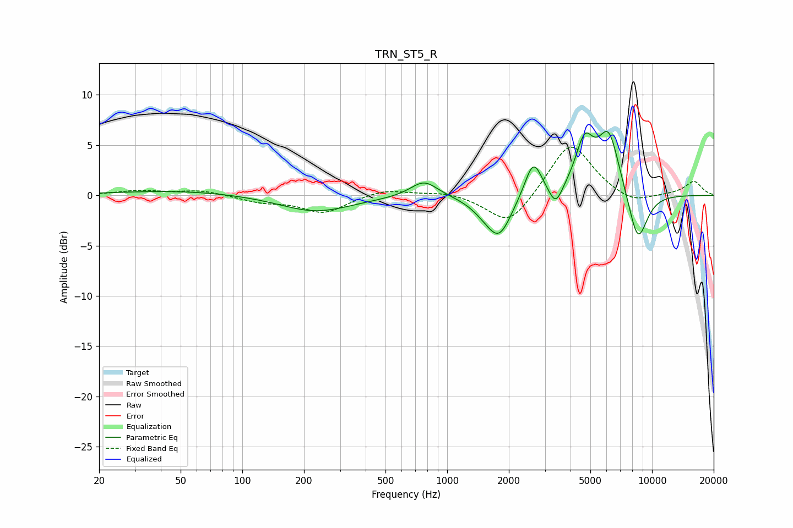

# TRN_ST5_R
See [usage instructions](https://github.com/jaakkopasanen/AutoEq#usage) for more options and info.

### Parametric EQs
Apply preamp of -6.5 dB when using parametric equalizer.

|   # | Type    |   Fc (Hz) |    Q |   Gain (dB) |
|-----|---------|-----------|------|-------------|
|   1 | Peaking |        50 | 0.45 |         0.5 |
|   2 | Peaking |       228 | 0.81 |        -1.6 |
|   3 | Peaking |       772 | 2.1  |         1.7 |
|   4 | Peaking |      1515 | 2.1  |        -0.8 |
|   5 | Peaking |      1795 | 2.32 |        -3.8 |
|   6 | Peaking |      2634 | 3.38 |         3.7 |
|   7 | Peaking |      3385 | 4.24 |        -2.1 |
|   8 | Peaking |      4686 | 3.09 |         4.7 |
|   9 | Peaking |      6148 | 2.5  |         6.2 |
|  10 | Peaking |      8520 | 2.72 |        -5.3 |

### Fixed Band EQs
When using fixed band (also called graphic) equalizer, apply preamp of **-4.9 dB** (if available) and set gains manually with these parameters.

|   # | Type    |   Fc (Hz) |    Q |   Gain (dB) |
|-----|---------|-----------|------|-------------|
|   1 | Peaking |        31 | 1.41 |         0.4 |
|   2 | Peaking |        62 | 1.41 |         0.5 |
|   3 | Peaking |       125 | 1.41 |        -0.6 |
|   4 | Peaking |       250 | 1.41 |        -1.7 |
|   5 | Peaking |       500 | 1.41 |         0.7 |
|   6 | Peaking |      1000 | 1.41 |         0.4 |
|   7 | Peaking |      2000 | 1.41 |        -3.2 |
|   8 | Peaking |      4000 | 1.41 |         5.5 |
|   9 | Peaking |      8000 | 1.41 |        -1   |
|  10 | Peaking |     16000 | 1.41 |         1.4 |

### Graphs

