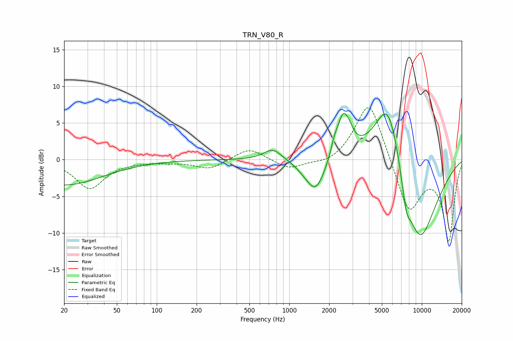

# TRN_V80_R
See [usage instructions](https://github.com/jaakkopasanen/AutoEq#usage) for more options and info.

### Parametric EQs
Apply preamp of -6.4 dB when using parametric equalizer.

|   # | Type    |   Fc (Hz) |    Q |   Gain (dB) |
|-----|---------|-----------|------|-------------|
|   1 | Peaking |        20 | 0.49 |        -3.5 |
|   2 | Peaking |       751 | 2.05 |         1.6 |
|   3 | Peaking |      1298 | 2.04 |        -0.6 |
|   4 | Peaking |      1589 | 2.01 |        -4.4 |
|   5 | Peaking |      2186 | 5.74 |         1.2 |
|   6 | Peaking |      2536 | 3.13 |         5.3 |
|   7 | Peaking |      2850 | 4.4  |         1.1 |
|   8 | Peaking |      5575 | 1.23 |        11.4 |
|   9 | Peaking |      7633 | 3.78 |        -3.5 |
|  10 | Peaking |      9534 | 0.88 |       -12.7 |

### Fixed Band EQs
When using fixed band (also called graphic) equalizer, apply preamp of **-7.2 dB** (if available) and set gains manually with these parameters.

|   # | Type    |   Fc (Hz) |    Q |   Gain (dB) |
|-----|---------|-----------|------|-------------|
|   1 | Peaking |        31 | 1.41 |        -3.9 |
|   2 | Peaking |        62 | 1.41 |        -0.2 |
|   3 | Peaking |       125 | 1.41 |        -0.2 |
|   4 | Peaking |       250 | 1.41 |        -1.3 |
|   5 | Peaking |       500 | 1.41 |         1.7 |
|   6 | Peaking |      1000 | 1.41 |        -1.4 |
|   7 | Peaking |      2000 | 1.41 |        -0.8 |
|   8 | Peaking |      4000 | 1.41 |         8.5 |
|   9 | Peaking |      8000 | 1.41 |        -7.3 |
|  10 | Peaking |     16000 | 1.41 |       -10.9 |

### Graphs

