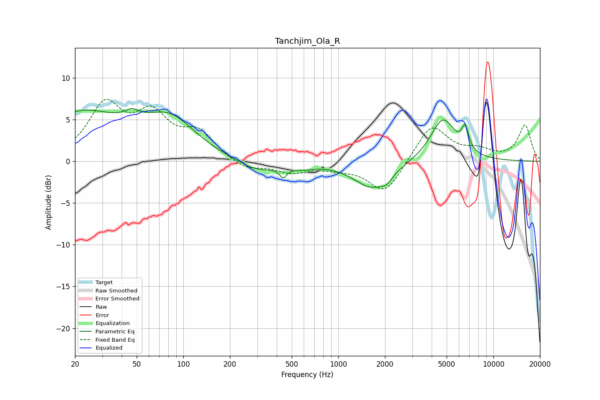

# Tanchjim_Ola_R
See [usage instructions](https://github.com/jaakkopasanen/AutoEq#usage) for more options and info.

### Parametric EQs
Apply preamp of -6.4 dB when using parametric equalizer.

|   # | Type    |   Fc (Hz) |    Q |   Gain (dB) |
|-----|---------|-----------|------|-------------|
|   1 | Peaking |        22 | 0.52 |         5.6 |
|   2 | Peaking |        47 | 3.01 |         1   |
|   3 | Peaking |        82 | 0.85 |         4.4 |
|   4 | Peaking |       296 | 1.13 |        -1.3 |
|   5 | Peaking |       441 | 5.99 |        -1.2 |
|   6 | Peaking |       590 | 2    |        -0.5 |
|   7 | Peaking |      1644 | 1.2  |        -3.1 |
|   8 | Peaking |      2052 | 4.16 |        -0.8 |
|   9 | Peaking |      4730 | 1.74 |         5.1 |
|  10 | Peaking |      6586 | 6    |         2.6 |

### Fixed Band EQs
When using fixed band (also called graphic) equalizer, apply preamp of **-7.5 dB** (if available) and set gains manually with these parameters.

|   # | Type    |   Fc (Hz) |    Q |   Gain (dB) |
|-----|---------|-----------|------|-------------|
|   1 | Peaking |        31 | 1.41 |         6.4 |
|   2 | Peaking |        62 | 1.41 |         4.9 |
|   3 | Peaking |       125 | 1.41 |         3.1 |
|   4 | Peaking |       250 | 1.41 |        -1.1 |
|   5 | Peaking |       500 | 1.41 |        -1.2 |
|   6 | Peaking |      1000 | 1.41 |        -0.6 |
|   7 | Peaking |      2000 | 1.41 |        -3.9 |
|   8 | Peaking |      4000 | 1.41 |         4.5 |
|   9 | Peaking |      8000 | 1.41 |         1.1 |
|  10 | Peaking |     16000 | 1.41 |         4.3 |

### Graphs

