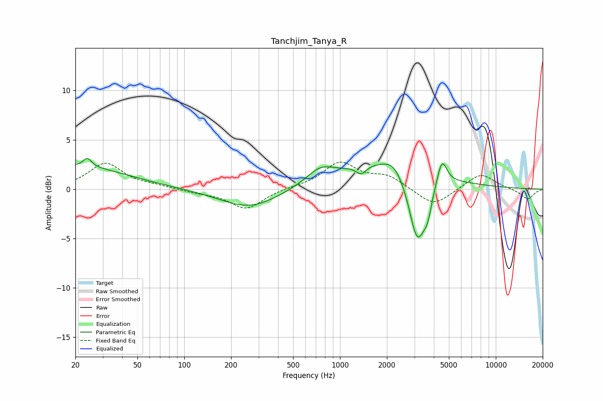

# Tanchjim_Tanya_R
See [usage instructions](https://github.com/jaakkopasanen/AutoEq#usage) for more options and info.

### Parametric EQs
Apply preamp of -3.2 dB when using parametric equalizer.

|   # | Type    |   Fc (Hz) |    Q |   Gain (dB) |
|-----|---------|-----------|------|-------------|
|   1 | Peaking |        20 | 0.43 |         2.3 |
|   2 | Peaking |        24 | 5.46 |         0.9 |
|   3 | Peaking |       262 | 0.76 |        -2   |
|   4 | Peaking |       747 | 1.59 |         1.4 |
|   5 | Peaking |      1366 | 4.49 |        -0.8 |
|   6 | Peaking |      2082 | 0.47 |         2.9 |
|   7 | Peaking |      2197 | 2.32 |         1   |
|   8 | Peaking |      3136 | 2.54 |        -7.2 |
|   9 | Peaking |      3652 | 5.38 |        -1.8 |
|  10 | Peaking |      4514 | 4.62 |         2.6 |

### Fixed Band EQs
When using fixed band (also called graphic) equalizer, apply preamp of **-2.8 dB** (if available) and set gains manually with these parameters.

|   # | Type    |   Fc (Hz) |    Q |   Gain (dB) |
|-----|---------|-----------|------|-------------|
|   1 | Peaking |        31 | 1.41 |         2.6 |
|   2 | Peaking |        62 | 1.41 |         0.3 |
|   3 | Peaking |       125 | 1.41 |        -0.3 |
|   4 | Peaking |       250 | 1.41 |        -2   |
|   5 | Peaking |       500 | 1.41 |         0.1 |
|   6 | Peaking |      1000 | 1.41 |         2.6 |
|   7 | Peaking |      2000 | 1.41 |         1.2 |
|   8 | Peaking |      4000 | 1.41 |        -1.8 |
|   9 | Peaking |      8000 | 1.41 |         1.6 |
|  10 | Peaking |     16000 | 1.41 |        -1   |

### Graphs

