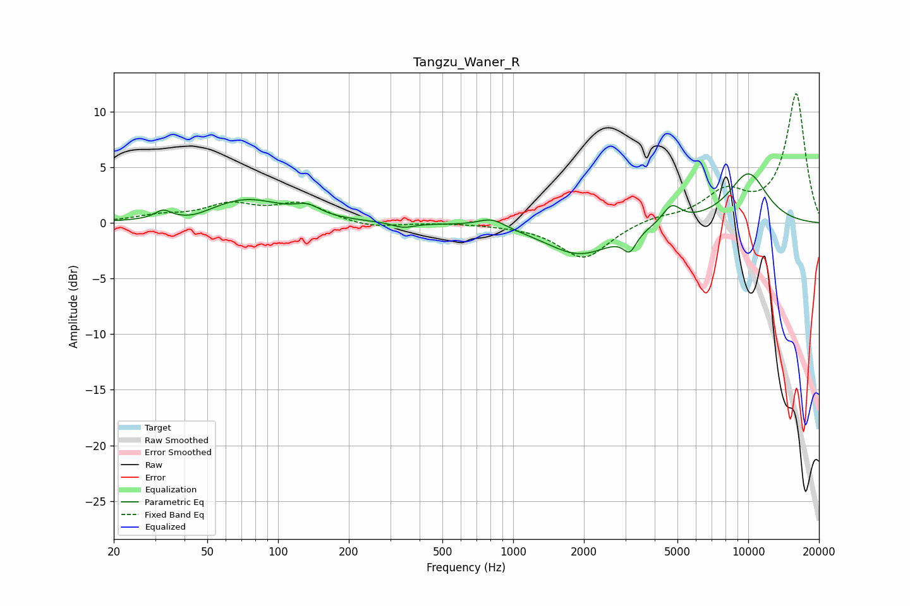

# Tangzu_Waner_R
See [usage instructions](https://github.com/jaakkopasanen/AutoEq#usage) for more options and info.

### Parametric EQs
Apply preamp of -4.5 dB when using parametric equalizer.

|   # | Type    |   Fc (Hz) |    Q |   Gain (dB) |
|-----|---------|-----------|------|-------------|
|   1 | Peaking |        32 | 4.36 |         0.8 |
|   2 | Peaking |        44 | 1.91 |        -0.5 |
|   3 | Peaking |        73 | 0.88 |         2.1 |
|   4 | Peaking |       134 | 2.68 |         0.8 |
|   5 | Peaking |       341 | 2.96 |        -0.5 |
|   6 | Peaking |       812 | 2.43 |         0.8 |
|   7 | Peaking |      1918 | 0.97 |        -2.8 |
|   8 | Peaking |      3134 | 5.11 |        -1.5 |
|   9 | Peaking |      4720 | 3.5  |         1.7 |
|  10 | Peaking |     10000 | 1.43 |         4.5 |

### Fixed Band EQs
When using fixed band (also called graphic) equalizer, apply preamp of **-11.7 dB** (if available) and set gains manually with these parameters.

|   # | Type    |   Fc (Hz) |    Q |   Gain (dB) |
|-----|---------|-----------|------|-------------|
|   1 | Peaking |        31 | 1.41 |         0.6 |
|   2 | Peaking |        62 | 1.41 |         1.5 |
|   3 | Peaking |       125 | 1.41 |         1.7 |
|   4 | Peaking |       250 | 1.41 |        -0.5 |
|   5 | Peaking |       500 | 1.41 |         0   |
|   6 | Peaking |      1000 | 1.41 |        -0.1 |
|   7 | Peaking |      2000 | 1.41 |        -3.2 |
|   8 | Peaking |      4000 | 1.41 |         0.5 |
|   9 | Peaking |      8000 | 1.41 |         2.6 |
|  10 | Peaking |     16000 | 1.41 |        11.6 |

### Graphs

