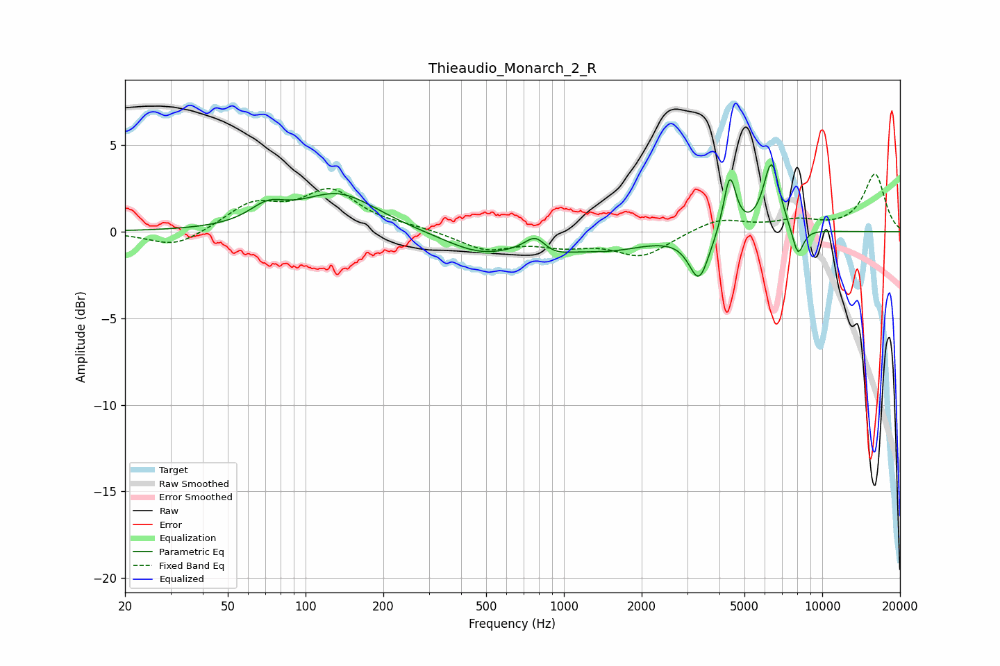

# Thieaudio_Monarch_2_R
See [usage instructions](https://github.com/jaakkopasanen/AutoEq#usage) for more options and info.

### Parametric EQs
Apply preamp of -4.0 dB when using parametric equalizer.

|   # | Type    |   Fc (Hz) |    Q |   Gain (dB) |
|-----|---------|-----------|------|-------------|
|   1 | Peaking |        71 | 2.03 |         1   |
|   2 | Peaking |       134 | 0.95 |         2.2 |
|   3 | Peaking |       479 | 0.99 |        -1.2 |
|   4 | Peaking |       777 | 3.54 |         0.9 |
|   5 | Peaking |       906 | 2.05 |        -0.6 |
|   6 | Peaking |      1470 | 0.91 |        -0.9 |
|   7 | Peaking |      3336 | 3.63 |        -2.7 |
|   8 | Peaking |      4386 | 5.74 |         3.4 |
|   9 | Peaking |      6365 | 4.26 |         4   |
|  10 | Peaking |      8053 | 5.88 |        -1.7 |

### Fixed Band EQs
When using fixed band (also called graphic) equalizer, apply preamp of **-3.4 dB** (if available) and set gains manually with these parameters.

|   # | Type    |   Fc (Hz) |    Q |   Gain (dB) |
|-----|---------|-----------|------|-------------|
|   1 | Peaking |        31 | 1.41 |        -0.9 |
|   2 | Peaking |        62 | 1.41 |         1.5 |
|   3 | Peaking |       125 | 1.41 |         2.2 |
|   4 | Peaking |       250 | 1.41 |         0.2 |
|   5 | Peaking |       500 | 1.41 |        -1   |
|   6 | Peaking |      1000 | 1.41 |        -0.6 |
|   7 | Peaking |      2000 | 1.41 |        -1.4 |
|   8 | Peaking |      4000 | 1.41 |         0.8 |
|   9 | Peaking |      8000 | 1.41 |         0.6 |
|  10 | Peaking |     16000 | 1.41 |         3.3 |

### Graphs

