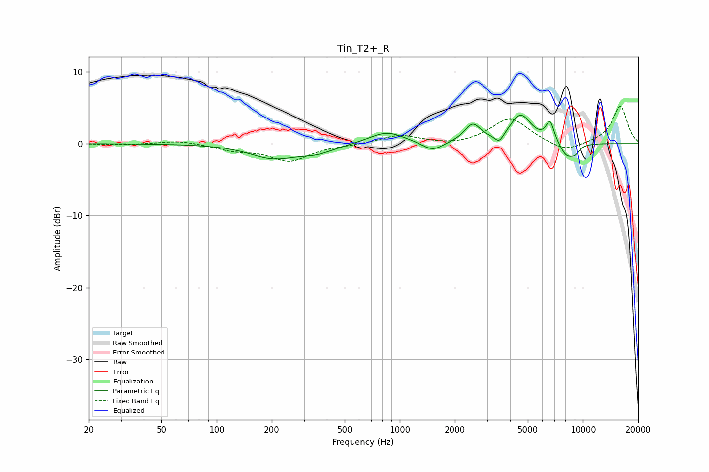

# Tin_T2+_R
See [usage instructions](https://github.com/jaakkopasanen/AutoEq#usage) for more options and info.

### Parametric EQs
Apply preamp of -4.0 dB when using parametric equalizer.

|   # | Type    |   Fc (Hz) |    Q |   Gain (dB) |
|-----|---------|-----------|------|-------------|
|   1 | Peaking |       202 | 1.13 |        -1.9 |
|   2 | Peaking |       351 | 1.43 |        -1   |
|   3 | Peaking |       847 | 1.48 |         1.7 |
|   4 | Peaking |      1510 | 2.53 |        -1.3 |
|   5 | Peaking |      2496 | 3.23 |         2.5 |
|   6 | Peaking |      3490 | 5.79 |        -1.3 |
|   7 | Peaking |      4567 | 2.4  |         3.9 |
|   8 | Peaking |      6613 | 5.88 |         2.8 |
|   9 | Peaking |      8120 | 3.45 |        -1.9 |
|  10 | Peaking |      9035 | 4.84 |        -1   |

### Fixed Band EQs
When using fixed band (also called graphic) equalizer, apply preamp of **-5.3 dB** (if available) and set gains manually with these parameters.

|   # | Type    |   Fc (Hz) |    Q |   Gain (dB) |
|-----|---------|-----------|------|-------------|
|   1 | Peaking |        31 | 1.41 |        -0.2 |
|   2 | Peaking |        62 | 1.41 |         0.5 |
|   3 | Peaking |       125 | 1.41 |        -0.8 |
|   4 | Peaking |       250 | 1.41 |        -2.3 |
|   5 | Peaking |       500 | 1.41 |        -0.2 |
|   6 | Peaking |      1000 | 1.41 |         1.2 |
|   7 | Peaking |      2000 | 1.41 |        -0.4 |
|   8 | Peaking |      4000 | 1.41 |         3.6 |
|   9 | Peaking |      8000 | 1.41 |        -1.3 |
|  10 | Peaking |     16000 | 1.41 |         5.2 |

### Graphs

