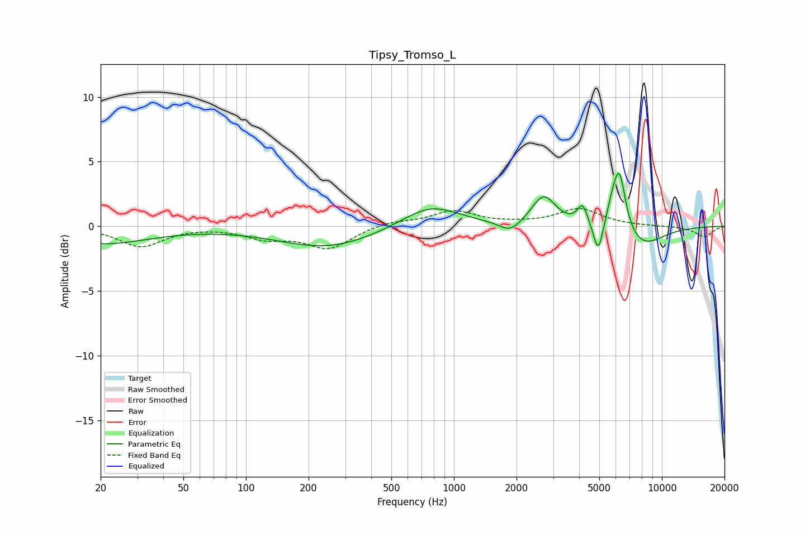

# Tipsy_Tromso_L
See [usage instructions](https://github.com/jaakkopasanen/AutoEq#usage) for more options and info.

### Parametric EQs
Apply preamp of -4.2 dB when using parametric equalizer.

|   # | Type    |   Fc (Hz) |    Q |   Gain (dB) |
|-----|---------|-----------|------|-------------|
|   1 | Peaking |        20 | 0.61 |        -1.3 |
|   2 | Peaking |       246 | 0.6  |        -1.7 |
|   3 | Peaking |       771 | 1.02 |         1.8 |
|   4 | Peaking |      1866 | 2.67 |        -0.9 |
|   5 | Peaking |      2701 | 2.46 |         2.3 |
|   6 | Peaking |      4157 | 5.72 |         1.5 |
|   7 | Peaking |      4947 | 5.95 |        -2.6 |
|   8 | Peaking |      5837 | 4.14 |         1.7 |
|   9 | Peaking |      6269 | 4.71 |         3.9 |
|  10 | Peaking |      8030 | 1.32 |        -1.6 |

### Fixed Band EQs
When using fixed band (also called graphic) equalizer, apply preamp of **-1.5 dB** (if available) and set gains manually with these parameters.

|   # | Type    |   Fc (Hz) |    Q |   Gain (dB) |
|-----|---------|-----------|------|-------------|
|   1 | Peaking |        31 | 1.41 |        -1.6 |
|   2 | Peaking |        62 | 1.41 |         0   |
|   3 | Peaking |       125 | 1.41 |        -0.8 |
|   4 | Peaking |       250 | 1.41 |        -1.7 |
|   5 | Peaking |       500 | 1.41 |         0.4 |
|   6 | Peaking |      1000 | 1.41 |         1.1 |
|   7 | Peaking |      2000 | 1.41 |         0.1 |
|   8 | Peaking |      4000 | 1.41 |         1.3 |
|   9 | Peaking |      8000 | 1.41 |        -0   |
|  10 | Peaking |     16000 | 1.41 |        -0.8 |

### Graphs

