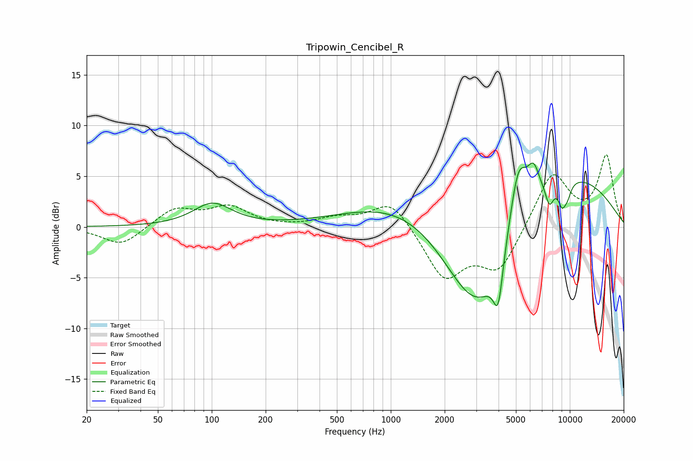

# Tripowin_Cencibel_R
See [usage instructions](https://github.com/jaakkopasanen/AutoEq#usage) for more options and info.

### Parametric EQs
Apply preamp of -6.4 dB when using parametric equalizer.

|   # | Type    |   Fc (Hz) |    Q |   Gain (dB) |
|-----|---------|-----------|------|-------------|
|   1 | Peaking |       101 | 1.33 |         2.3 |
|   2 | Peaking |      3125 | 0.65 |        -9.7 |
|   3 | Peaking |      3147 | 0.61 |        -6.6 |
|   4 | Peaking |      3979 | 5.37 |        -4.5 |
|   5 | Peaking |      4319 | 0.21 |         9.4 |
|   6 | Peaking |      5139 | 2.68 |         6.6 |
|   7 | Peaking |      6277 | 3.87 |         2.9 |
|   8 | Peaking |      7699 | 5.71 |        -2   |
|   9 | Peaking |      9058 | 5.86 |        -2   |
|  10 | Peaking |      9692 | 5.79 |        -1.2 |

### Fixed Band EQs
When using fixed band (also called graphic) equalizer, apply preamp of **-7.2 dB** (if available) and set gains manually with these parameters.

|   # | Type    |   Fc (Hz) |    Q |   Gain (dB) |
|-----|---------|-----------|------|-------------|
|   1 | Peaking |        31 | 1.41 |        -1.9 |
|   2 | Peaking |        62 | 1.41 |         1.8 |
|   3 | Peaking |       125 | 1.41 |         1.9 |
|   4 | Peaking |       250 | 1.41 |        -0   |
|   5 | Peaking |       500 | 1.41 |         0.8 |
|   6 | Peaking |      1000 | 1.41 |         2.8 |
|   7 | Peaking |      2000 | 1.41 |        -5   |
|   8 | Peaking |      4000 | 1.41 |        -4.2 |
|   9 | Peaking |      8000 | 1.41 |         5.5 |
|  10 | Peaking |     16000 | 1.41 |         6.9 |

### Graphs

