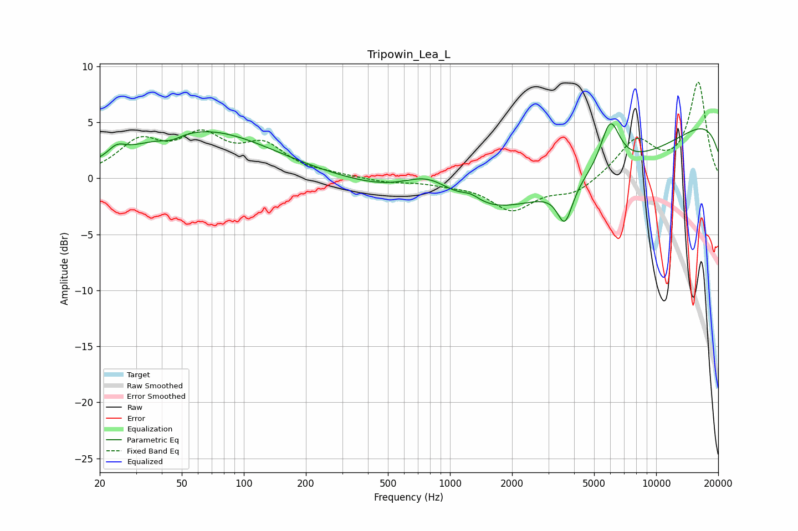

# Tripowin_Lea_L
See [usage instructions](https://github.com/jaakkopasanen/AutoEq#usage) for more options and info.

### Parametric EQs
Apply preamp of -5.0 dB when using parametric equalizer.

|   # | Type    |   Fc (Hz) |    Q |   Gain (dB) |
|-----|---------|-----------|------|-------------|
|   1 | Peaking |        20 | 2.32 |        -0.1 |
|   2 | Peaking |        24 | 3.42 |         0.9 |
|   3 | Peaking |        45 | 2.82 |        -0.5 |
|   4 | Peaking |        63 | 0.43 |         4.3 |
|   5 | Peaking |       791 | 1.07 |         2.7 |
|   6 | Peaking |      1259 | 2.9  |         0.7 |
|   7 | Peaking |      3610 | 3.84 |        -3.3 |
|   8 | Peaking |      3635 | 0.18 |        -6.8 |
|   9 | Peaking |      5991 | 2.92 |         4.3 |
|  10 | Peaking |     10000 | 0.18 |         7.7 |

### Fixed Band EQs
When using fixed band (also called graphic) equalizer, apply preamp of **-8.7 dB** (if available) and set gains manually with these parameters.

|   # | Type    |   Fc (Hz) |    Q |   Gain (dB) |
|-----|---------|-----------|------|-------------|
|   1 | Peaking |        31 | 1.41 |         3   |
|   2 | Peaking |        62 | 1.41 |         3.3 |
|   3 | Peaking |       125 | 1.41 |         2.6 |
|   4 | Peaking |       250 | 1.41 |         0.2 |
|   5 | Peaking |       500 | 1.41 |        -0.3 |
|   6 | Peaking |      1000 | 1.41 |        -0.4 |
|   7 | Peaking |      2000 | 1.41 |        -2.7 |
|   8 | Peaking |      4000 | 1.41 |        -1.3 |
|   9 | Peaking |      8000 | 1.41 |         3.3 |
|  10 | Peaking |     16000 | 1.41 |         8.5 |

### Graphs

