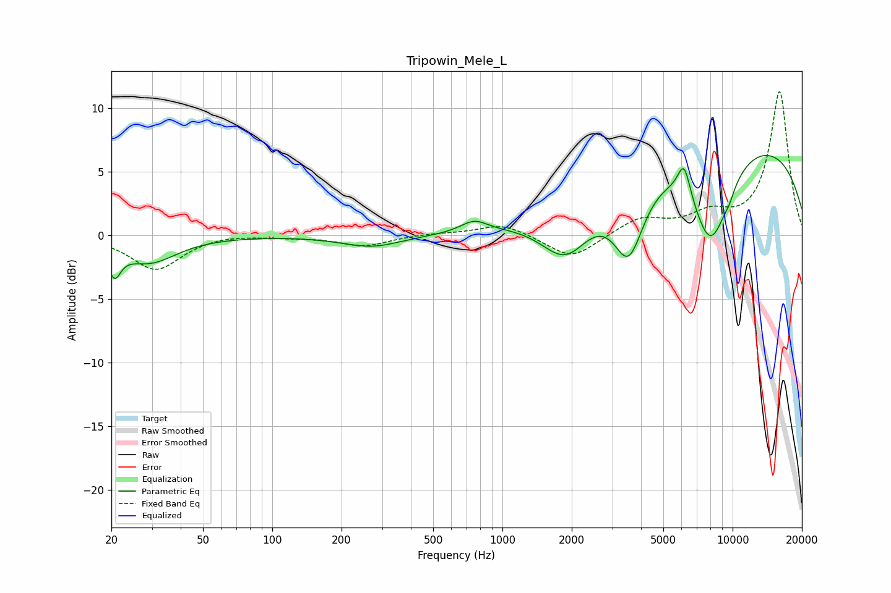

# Tripowin_Mele_L
See [usage instructions](https://github.com/jaakkopasanen/AutoEq#usage) for more options and info.

### Parametric EQs
Apply preamp of -6.4 dB when using parametric equalizer.

|   # | Type    |   Fc (Hz) |    Q |   Gain (dB) |
|-----|---------|-----------|------|-------------|
|   1 | Peaking |        21 | 5.3  |        -2.2 |
|   2 | Peaking |        29 | 1.17 |        -2.1 |
|   3 | Peaking |       270 | 1.09 |        -0.9 |
|   4 | Peaking |       754 | 2.43 |         0.9 |
|   5 | Peaking |      1888 | 1.29 |        -4.1 |
|   6 | Peaking |      3535 | 2.08 |        -5.8 |
|   7 | Peaking |      6152 | 4.93 |         2.6 |
|   8 | Peaking |      8024 | 1.53 |        -7.5 |
|   9 | Peaking |      9337 | 0.2  |         7.8 |
|  10 | Peaking |      9684 | 5.27 |        -0.5 |

### Fixed Band EQs
When using fixed band (also called graphic) equalizer, apply preamp of **-11.4 dB** (if available) and set gains manually with these parameters.

|   # | Type    |   Fc (Hz) |    Q |   Gain (dB) |
|-----|---------|-----------|------|-------------|
|   1 | Peaking |        31 | 1.41 |        -2.7 |
|   2 | Peaking |        62 | 1.41 |         0.2 |
|   3 | Peaking |       125 | 1.41 |        -0.1 |
|   4 | Peaking |       250 | 1.41 |        -0.8 |
|   5 | Peaking |       500 | 1.41 |         0.1 |
|   6 | Peaking |      1000 | 1.41 |         0.9 |
|   7 | Peaking |      2000 | 1.41 |        -1.9 |
|   8 | Peaking |      4000 | 1.41 |         1.3 |
|   9 | Peaking |      8000 | 1.41 |         1.4 |
|  10 | Peaking |     16000 | 1.41 |        11.3 |

### Graphs

