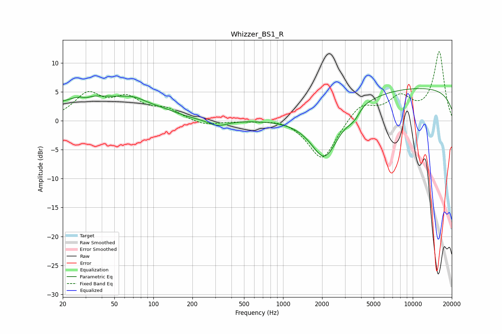

# Whizzer_BS1_R
See [usage instructions](https://github.com/jaakkopasanen/AutoEq#usage) for more options and info.

### Parametric EQs
Apply preamp of -5.6 dB when using parametric equalizer.

|   # | Type    |   Fc (Hz) |    Q |   Gain (dB) |
|-----|---------|-----------|------|-------------|
|   1 | Peaking |        20 | 2.12 |        -0.6 |
|   2 | Peaking |        27 | 0.44 |         4.2 |
|   3 | Peaking |        30 | 4.94 |        -0.3 |
|   4 | Peaking |        71 | 1.21 |         1.7 |
|   5 | Peaking |       120 | 1.27 |         0.7 |
|   6 | Peaking |       313 | 1.88 |        -1.1 |
|   7 | Peaking |      2102 | 1.27 |        -8.8 |
|   8 | Peaking |      3520 | 2.72 |        -1.5 |
|   9 | Peaking |      4173 | 2.66 |         0.4 |
|  10 | Peaking |     10000 | 0.18 |         5.7 |

### Fixed Band EQs
When using fixed band (also called graphic) equalizer, apply preamp of **-12.0 dB** (if available) and set gains manually with these parameters.

|   # | Type    |   Fc (Hz) |    Q |   Gain (dB) |
|-----|---------|-----------|------|-------------|
|   1 | Peaking |        31 | 1.41 |         4.3 |
|   2 | Peaking |        62 | 1.41 |         3.4 |
|   3 | Peaking |       125 | 1.41 |         1.7 |
|   4 | Peaking |       250 | 1.41 |        -0.9 |
|   5 | Peaking |       500 | 1.41 |        -0   |
|   6 | Peaking |      1000 | 1.41 |         0.5 |
|   7 | Peaking |      2000 | 1.41 |        -7   |
|   8 | Peaking |      4000 | 1.41 |         3   |
|   9 | Peaking |      8000 | 1.41 |         3.7 |
|  10 | Peaking |     16000 | 1.41 |        11.8 |

### Graphs

