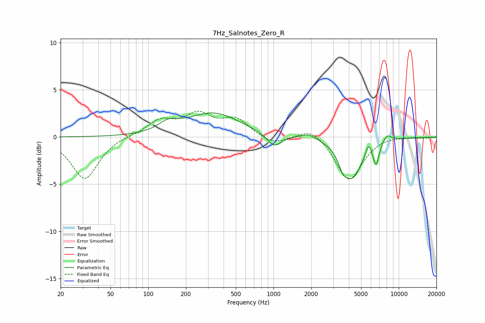

# 7Hz_Salnotes_Zero_R
See [usage instructions](https://github.com/jaakkopasanen/AutoEq#usage) for more options and info.

### Parametric EQs
Apply preamp of -2.7 dB when using parametric equalizer.

|   # | Type    |   Fc (Hz) |    Q |   Gain (dB) |
|-----|---------|-----------|------|-------------|
|   1 | Peaking |       145 | 1.81 |         0.9 |
|   2 | Peaking |       332 | 0.67 |         2.5 |
|   3 | Peaking |      1012 | 2.45 |        -1.4 |
|   4 | Peaking |      1912 | 2.41 |         0.5 |
|   5 | Peaking |      3570 | 4.56 |        -1.1 |
|   6 | Peaking |      4245 | 1.74 |        -4.2 |
|   7 | Peaking |      5769 | 6    |         1.3 |
|   8 | Peaking |      6401 | 6    |        -0.6 |
|   9 | Peaking |      6626 | 6    |        -1.8 |
|  10 | Peaking |      8071 | 3.92 |         0.8 |

### Fixed Band EQs
When using fixed band (also called graphic) equalizer, apply preamp of **-2.8 dB** (if available) and set gains manually with these parameters.

|   # | Type    |   Fc (Hz) |    Q |   Gain (dB) |
|-----|---------|-----------|------|-------------|
|   1 | Peaking |        31 | 1.41 |        -4.5 |
|   2 | Peaking |        62 | 1.41 |         0.2 |
|   3 | Peaking |       125 | 1.41 |         1.7 |
|   4 | Peaking |       250 | 1.41 |         2.2 |
|   5 | Peaking |       500 | 1.41 |         1.8 |
|   6 | Peaking |      1000 | 1.41 |        -0.9 |
|   7 | Peaking |      2000 | 1.41 |         1.2 |
|   8 | Peaking |      4000 | 1.41 |        -4.7 |
|   9 | Peaking |      8000 | 1.41 |         0.2 |
|  10 | Peaking |     16000 | 1.41 |        -0.1 |

### Graphs

