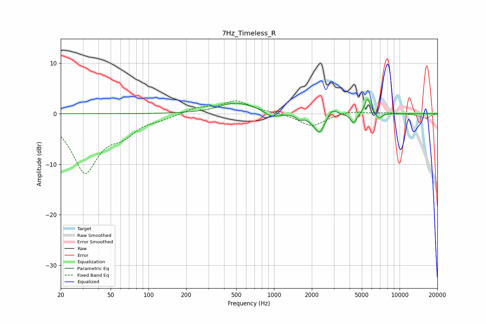

# 7Hz_Timeless_R
See [usage instructions](https://github.com/jaakkopasanen/AutoEq#usage) for more options and info.

### Parametric EQs
Apply preamp of -2.9 dB when using parametric equalizer.

|   # | Type    |   Fc (Hz) |    Q |   Gain (dB) |
|-----|---------|-----------|------|-------------|
|   1 | Peaking |       489 | 1.11 |         2.1 |
|   2 | Peaking |       692 | 2.66 |         0.3 |
|   3 | Peaking |       966 | 2.68 |        -1   |
|   4 | Peaking |      1593 | 5.26 |        -0.8 |
|   5 | Peaking |      2002 | 3.4  |        -0.5 |
|   6 | Peaking |      2310 | 3.53 |        -3.6 |
|   7 | Peaking |      2912 | 4.04 |         1.5 |
|   8 | Peaking |      4306 | 6    |        -2   |
|   9 | Peaking |      5557 | 5.99 |         3.1 |
|  10 | Peaking |      6852 | 6    |        -1.1 |

### Fixed Band EQs
When using fixed band (also called graphic) equalizer, apply preamp of **-2.6 dB** (if available) and set gains manually with these parameters.

|   # | Type    |   Fc (Hz) |    Q |   Gain (dB) |
|-----|---------|-----------|------|-------------|
|   1 | Peaking |        31 | 1.41 |       -11.3 |
|   2 | Peaking |        62 | 1.41 |        -3   |
|   3 | Peaking |       125 | 1.41 |        -0.7 |
|   4 | Peaking |       250 | 1.41 |         1.2 |
|   5 | Peaking |       500 | 1.41 |         2.4 |
|   6 | Peaking |      1000 | 1.41 |         0.2 |
|   7 | Peaking |      2000 | 1.41 |        -2.5 |
|   8 | Peaking |      4000 | 1.41 |         0.6 |
|   9 | Peaking |      8000 | 1.41 |         0.2 |
|  10 | Peaking |     16000 | 1.41 |        -0.9 |

### Graphs

