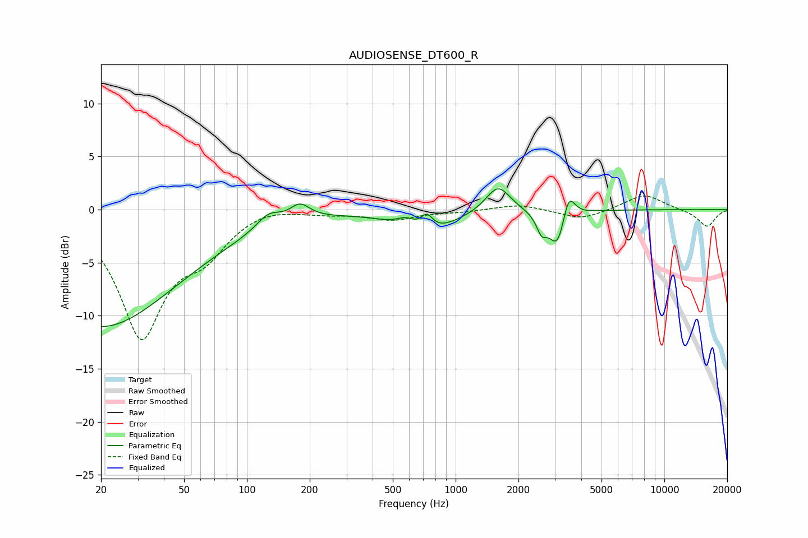

# AUDIOSENSE_DT600_R
See [usage instructions](https://github.com/jaakkopasanen/AutoEq#usage) for more options and info.

### Parametric EQs
Apply preamp of -2.0 dB when using parametric equalizer.

|   # | Type    |   Fc (Hz) |    Q |   Gain (dB) |
|-----|---------|-----------|------|-------------|
|   1 | Peaking |        20 | 0.37 |       -11   |
|   2 | Peaking |       127 | 2.44 |         1.3 |
|   3 | Peaking |       180 | 3.01 |         1.4 |
|   4 | Peaking |       580 | 3.1  |         1   |
|   5 | Peaking |       709 | 1.09 |        -2.4 |
|   6 | Peaking |       727 | 4.62 |         1.6 |
|   7 | Peaking |      1597 | 2.42 |         2.6 |
|   8 | Peaking |      2579 | 5.88 |        -1.5 |
|   9 | Peaking |      3092 | 3.36 |        -3.9 |
|  10 | Peaking |      3467 | 4.74 |         3   |

### Fixed Band EQs
When using fixed band (also called graphic) equalizer, apply preamp of **-1.4 dB** (if available) and set gains manually with these parameters.

|   # | Type    |   Fc (Hz) |    Q |   Gain (dB) |
|-----|---------|-----------|------|-------------|
|   1 | Peaking |        31 | 1.41 |       -11.7 |
|   2 | Peaking |        62 | 1.41 |        -3.1 |
|   3 | Peaking |       125 | 1.41 |         0.5 |
|   4 | Peaking |       250 | 1.41 |        -0.3 |
|   5 | Peaking |       500 | 1.41 |        -0.9 |
|   6 | Peaking |      1000 | 1.41 |        -0.2 |
|   7 | Peaking |      2000 | 1.41 |         0.5 |
|   8 | Peaking |      4000 | 1.41 |        -1   |
|   9 | Peaking |      8000 | 1.41 |         1.5 |
|  10 | Peaking |     16000 | 1.41 |        -1.6 |

### Graphs

