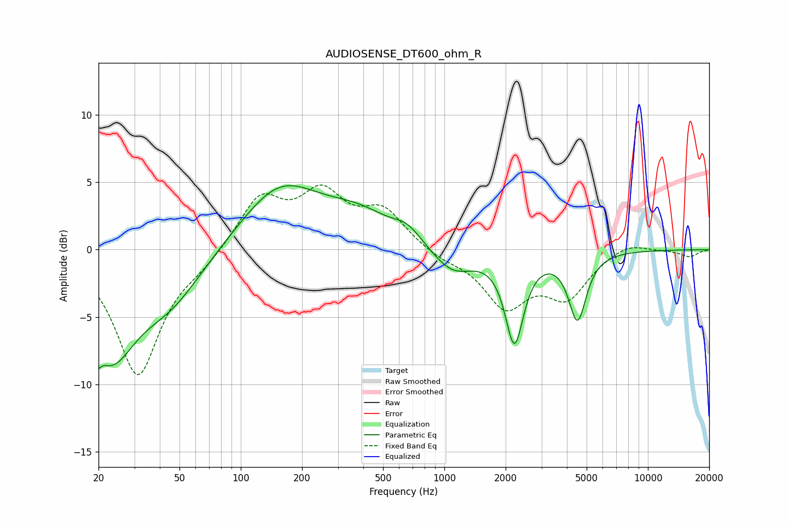

# AUDIOSENSE_DT600_ohm_R
See [usage instructions](https://github.com/jaakkopasanen/AutoEq#usage) for more options and info.

### Parametric EQs
Apply preamp of -4.8 dB when using parametric equalizer.

|   # | Type    |   Fc (Hz) |    Q |   Gain (dB) |
|-----|---------|-----------|------|-------------|
|   1 | Peaking |        20 | 4.36 |        -5.9 |
|   2 | Peaking |        20 | 4.78 |         4   |
|   3 | Peaking |        23 | 1.16 |        -6.7 |
|   4 | Peaking |        45 | 0.85 |        -3.4 |
|   5 | Peaking |       156 | 0.72 |         4.7 |
|   6 | Peaking |       382 | 0.83 |         2   |
|   7 | Peaking |       660 | 2.06 |         1   |
|   8 | Peaking |      1094 | 1.41 |        -1.9 |
|   9 | Peaking |      2210 | 3.14 |        -6.6 |
|  10 | Peaking |      4507 | 3.26 |        -5   |

### Fixed Band EQs
When using fixed band (also called graphic) equalizer, apply preamp of **-4.9 dB** (if available) and set gains manually with these parameters.

|   # | Type    |   Fc (Hz) |    Q |   Gain (dB) |
|-----|---------|-----------|------|-------------|
|   1 | Peaking |        31 | 1.41 |        -9.3 |
|   2 | Peaking |        62 | 1.41 |        -0.8 |
|   3 | Peaking |       125 | 1.41 |         3.8 |
|   4 | Peaking |       250 | 1.41 |         3.8 |
|   5 | Peaking |       500 | 1.41 |         2.7 |
|   6 | Peaking |      1000 | 1.41 |        -0.6 |
|   7 | Peaking |      2000 | 1.41 |        -4   |
|   8 | Peaking |      4000 | 1.41 |        -3.2 |
|   9 | Peaking |      8000 | 1.41 |         0.7 |
|  10 | Peaking |     16000 | 1.41 |        -0.5 |

### Graphs

