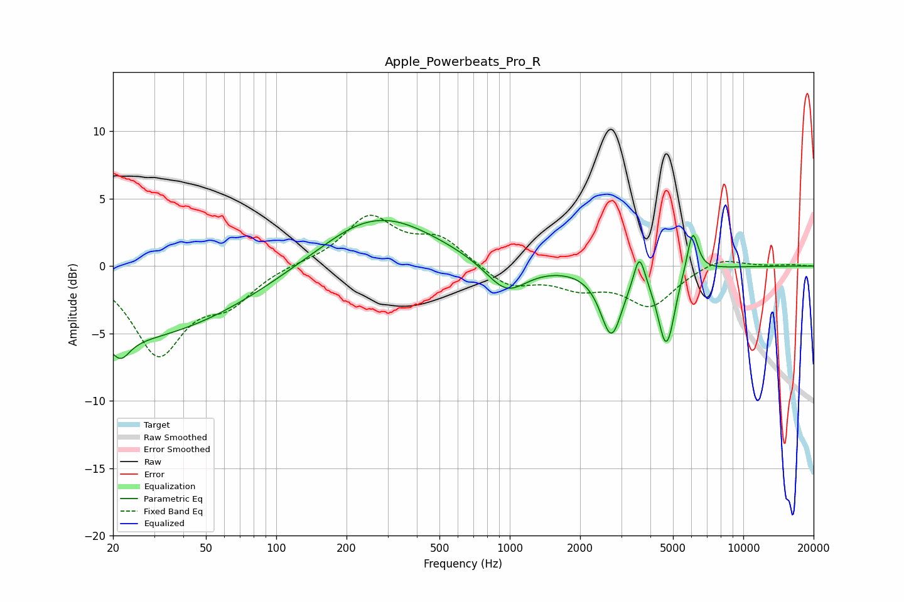

# Apple_Powerbeats_Pro_R
See [usage instructions](https://github.com/jaakkopasanen/AutoEq#usage) for more options and info.

### Parametric EQs
Apply preamp of -3.5 dB when using parametric equalizer.

|   # | Type    |   Fc (Hz) |    Q |   Gain (dB) |
|-----|---------|-----------|------|-------------|
|   1 | Peaking |        20 | 0.25 |        -5.5 |
|   2 | Peaking |        22 | 3.75 |        -1.4 |
|   3 | Peaking |       214 | 1.86 |         0.1 |
|   4 | Peaking |       274 | 0.58 |         3.9 |
|   5 | Peaking |       966 | 1.6  |        -2.3 |
|   6 | Peaking |      2723 | 3.05 |        -4.9 |
|   7 | Peaking |      3589 | 6    |         2.4 |
|   8 | Peaking |      4643 | 4.01 |        -5.1 |
|   9 | Peaking |      4901 | 6    |        -0.8 |
|  10 | Peaking |      6069 | 5.82 |         3.2 |

### Fixed Band EQs
When using fixed band (also called graphic) equalizer, apply preamp of **-3.9 dB** (if available) and set gains manually with these parameters.

|   # | Type    |   Fc (Hz) |    Q |   Gain (dB) |
|-----|---------|-----------|------|-------------|
|   1 | Peaking |        31 | 1.41 |        -6.3 |
|   2 | Peaking |        62 | 1.41 |        -2.3 |
|   3 | Peaking |       125 | 1.41 |         0.2 |
|   4 | Peaking |       250 | 1.41 |         3.6 |
|   5 | Peaking |       500 | 1.41 |         1.9 |
|   6 | Peaking |      1000 | 1.41 |        -1.5 |
|   7 | Peaking |      2000 | 1.41 |        -1.3 |
|   8 | Peaking |      4000 | 1.41 |        -2.8 |
|   9 | Peaking |      8000 | 1.41 |         0.7 |
|  10 | Peaking |     16000 | 1.41 |         0.1 |

### Graphs

