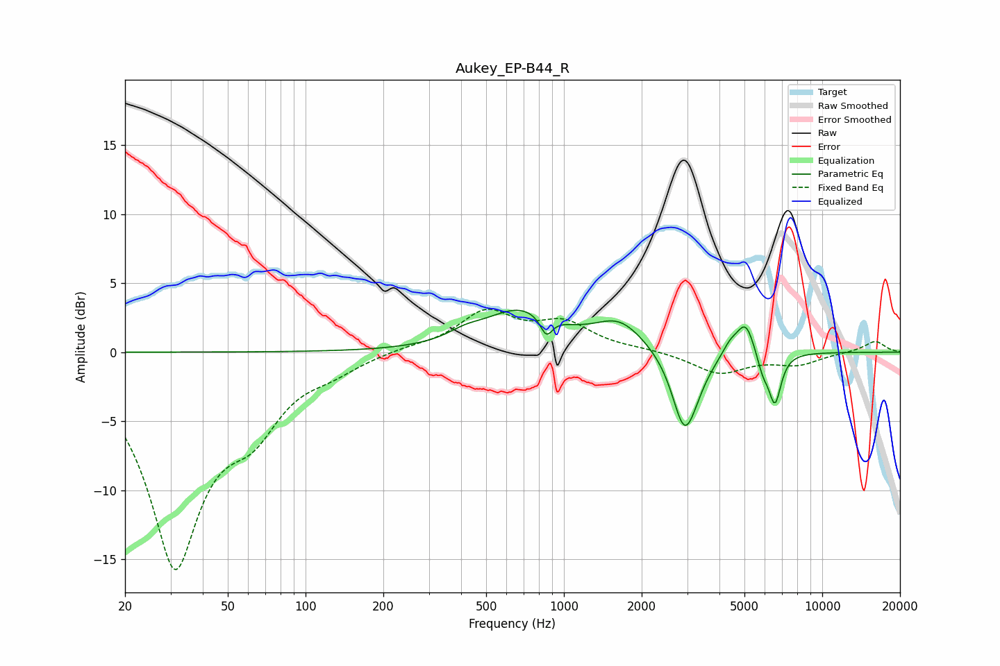

# Aukey_EP-B44_R
See [usage instructions](https://github.com/jaakkopasanen/AutoEq#usage) for more options and info.

### Parametric EQs
Apply preamp of -3.1 dB when using parametric equalizer.

|   # | Type    |   Fc (Hz) |    Q |   Gain (dB) |
|-----|---------|-----------|------|-------------|
|   1 | Peaking |       415 | 2.06 |         0.6 |
|   2 | Peaking |       679 | 1.01 |         2.9 |
|   3 | Peaking |       855 | 6    |        -1.4 |
|   4 | Peaking |      1642 | 1.47 |         2   |
|   5 | Peaking |      2929 | 2.98 |        -5.3 |
|   6 | Peaking |      3208 | 2.51 |        -0.9 |
|   7 | Peaking |      4402 | 4.41 |         0.9 |
|   8 | Peaking |      5054 | 4.06 |         2.4 |
|   9 | Peaking |      5887 | 6    |        -1.3 |
|  10 | Peaking |      6559 | 5.64 |        -3.6 |

### Fixed Band EQs
When using fixed band (also called graphic) equalizer, apply preamp of **-3.2 dB** (if available) and set gains manually with these parameters.

|   # | Type    |   Fc (Hz) |    Q |   Gain (dB) |
|-----|---------|-----------|------|-------------|
|   1 | Peaking |        31 | 1.41 |       -15   |
|   2 | Peaking |        62 | 1.41 |        -3.8 |
|   3 | Peaking |       125 | 1.41 |        -0.9 |
|   4 | Peaking |       250 | 1.41 |         0.3 |
|   5 | Peaking |       500 | 1.41 |         2.8 |
|   6 | Peaking |      1000 | 1.41 |         1.9 |
|   7 | Peaking |      2000 | 1.41 |         0.2 |
|   8 | Peaking |      4000 | 1.41 |        -1.5 |
|   9 | Peaking |      8000 | 1.41 |        -0.8 |
|  10 | Peaking |     16000 | 1.41 |         0.8 |

### Graphs

