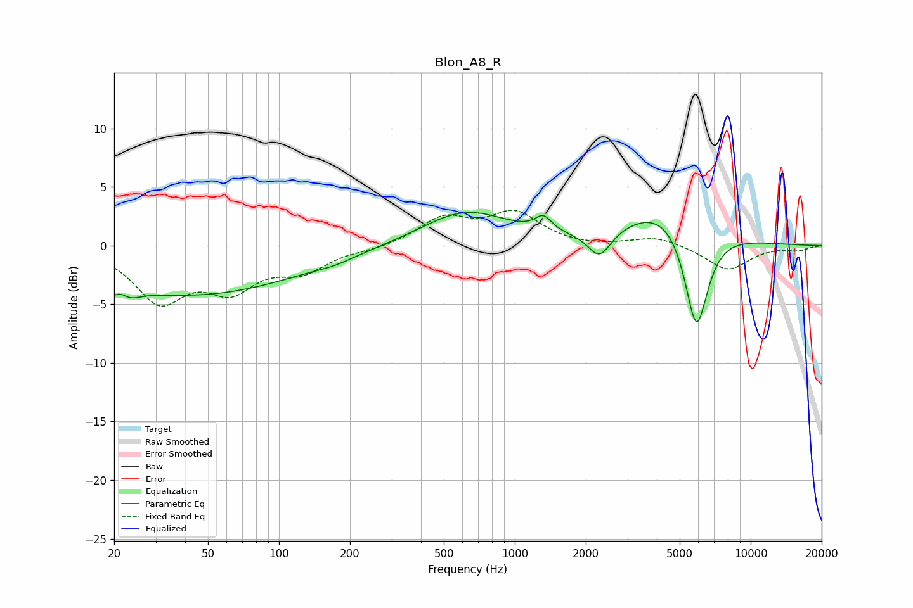

# Blon_A8_R
See [usage instructions](https://github.com/jaakkopasanen/AutoEq#usage) for more options and info.

### Parametric EQs
Apply preamp of -2.9 dB when using parametric equalizer.

|   # | Type    |   Fc (Hz) |    Q |   Gain (dB) |
|-----|---------|-----------|------|-------------|
|   1 | Peaking |        20 | 5.73 |        -3.4 |
|   2 | Peaking |        21 | 5.78 |         3.1 |
|   3 | Peaking |        23 | 3.05 |        -0.7 |
|   4 | Peaking |        42 | 0.3  |        -4.2 |
|   5 | Peaking |       173 | 1.9  |        -0.3 |
|   6 | Peaking |       616 | 0.76 |         2.9 |
|   7 | Peaking |      1321 | 4.08 |         1.3 |
|   8 | Peaking |      2285 | 2.84 |        -2.4 |
|   9 | Peaking |      4475 | 0.78 |         3.6 |
|  10 | Peaking |      5881 | 2.65 |        -9.5 |

### Fixed Band EQs
When using fixed band (also called graphic) equalizer, apply preamp of **-3.1 dB** (if available) and set gains manually with these parameters.

|   # | Type    |   Fc (Hz) |    Q |   Gain (dB) |
|-----|---------|-----------|------|-------------|
|   1 | Peaking |        31 | 1.41 |        -4.5 |
|   2 | Peaking |        62 | 1.41 |        -3.2 |
|   3 | Peaking |       125 | 1.41 |        -1.9 |
|   4 | Peaking |       250 | 1.41 |        -0.3 |
|   5 | Peaking |       500 | 1.41 |         2.3 |
|   6 | Peaking |      1000 | 1.41 |         2.6 |
|   7 | Peaking |      2000 | 1.41 |        -0.2 |
|   8 | Peaking |      4000 | 1.41 |         0.8 |
|   9 | Peaking |      8000 | 1.41 |        -2.1 |
|  10 | Peaking |     16000 | 1.41 |        -0.4 |

### Graphs

