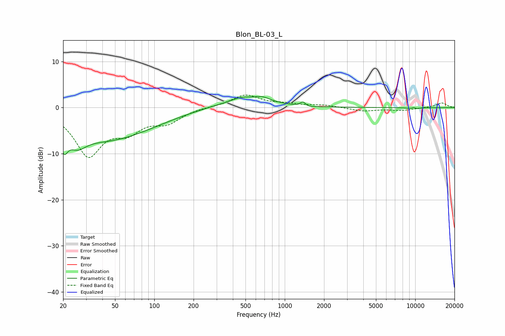

# Blon_BL-03_L
See [usage instructions](https://github.com/jaakkopasanen/AutoEq#usage) for more options and info.

### Parametric EQs
Apply preamp of -2.5 dB when using parametric equalizer.

|   # | Type    |   Fc (Hz) |    Q |   Gain (dB) |
|-----|---------|-----------|------|-------------|
|   1 | Peaking |        20 | 5.07 |        -3.9 |
|   2 | Peaking |        26 | 2.16 |        -2.9 |
|   3 | Peaking |        43 | 0.39 |        -6.9 |
|   4 | Peaking |       467 | 1.92 |         0.9 |
|   5 | Peaking |       470 | 0.57 |         1.5 |
|   6 | Peaking |       672 | 2.41 |         1   |
|   7 | Peaking |      1381 | 5.88 |         1.7 |
|   8 | Peaking |      1400 | 3.48 |        -1   |
|   9 | Peaking |      9751 | 5.92 |         2.1 |
|  10 | Peaking |      9758 | 5.04 |        -2.1 |

### Fixed Band EQs
When using fixed band (also called graphic) equalizer, apply preamp of **-2.8 dB** (if available) and set gains manually with these parameters.

|   # | Type    |   Fc (Hz) |    Q |   Gain (dB) |
|-----|---------|-----------|------|-------------|
|   1 | Peaking |        31 | 1.41 |       -10   |
|   2 | Peaking |        62 | 1.41 |        -4   |
|   3 | Peaking |       125 | 1.41 |        -2.8 |
|   4 | Peaking |       250 | 1.41 |         0.2 |
|   5 | Peaking |       500 | 1.41 |         2.7 |
|   6 | Peaking |      1000 | 1.41 |         0.6 |
|   7 | Peaking |      2000 | 1.41 |         0.5 |
|   8 | Peaking |      4000 | 1.41 |        -0.8 |
|   9 | Peaking |      8000 | 1.41 |        -0.6 |
|  10 | Peaking |     16000 | 1.41 |         1   |

### Graphs

