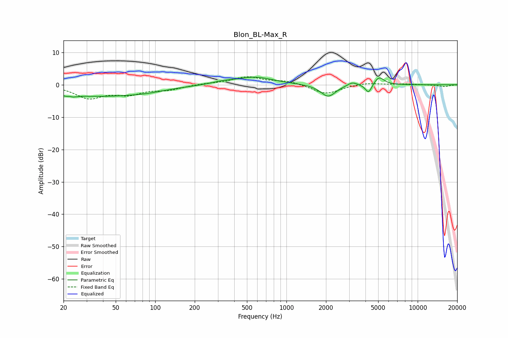

# Blon_BL-Max_R
See [usage instructions](https://github.com/jaakkopasanen/AutoEq#usage) for more options and info.

### Parametric EQs
Apply preamp of -2.4 dB when using parametric equalizer.

|   # | Type    |   Fc (Hz) |    Q |   Gain (dB) |
|-----|---------|-----------|------|-------------|
|   1 | Peaking |        22 | 4.73 |        -3.4 |
|   2 | Peaking |        22 | 6    |         2.7 |
|   3 | Peaking |        36 | 0.4  |        -3.4 |
|   4 | Peaking |        86 | 0.98 |        -0.6 |
|   5 | Peaking |       326 | 1.71 |         0.6 |
|   6 | Peaking |       573 | 0.99 |         2.4 |
|   7 | Peaking |      2079 | 2.49 |        -3.8 |
|   8 | Peaking |      3173 | 3.82 |         1.1 |
|   9 | Peaking |      4226 | 5.81 |        -2.9 |
|  10 | Peaking |      5080 | 3.73 |         2.6 |

### Fixed Band EQs
When using fixed band (also called graphic) equalizer, apply preamp of **-2.6 dB** (if available) and set gains manually with these parameters.

|   # | Type    |   Fc (Hz) |    Q |   Gain (dB) |
|-----|---------|-----------|------|-------------|
|   1 | Peaking |        31 | 1.41 |        -3.9 |
|   2 | Peaking |        62 | 1.41 |        -2.5 |
|   3 | Peaking |       125 | 1.41 |        -1.3 |
|   4 | Peaking |       250 | 1.41 |         0.4 |
|   5 | Peaking |       500 | 1.41 |         2.4 |
|   6 | Peaking |      1000 | 1.41 |         1.2 |
|   7 | Peaking |      2000 | 1.41 |        -2.9 |
|   8 | Peaking |      4000 | 1.41 |         0.7 |
|   9 | Peaking |      8000 | 1.41 |         0.2 |
|  10 | Peaking |     16000 | 1.41 |        -0.6 |

### Graphs

