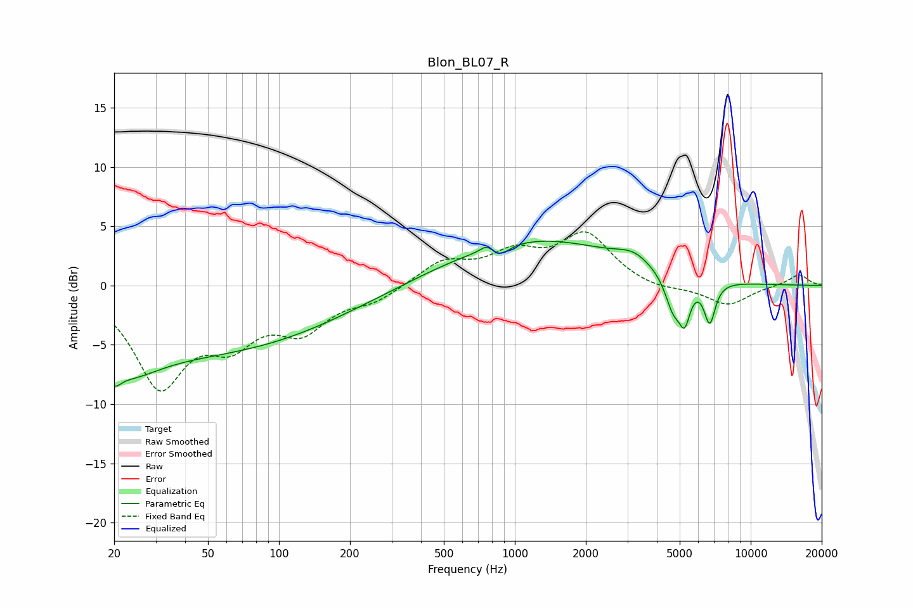

# Blon_BL07_R
See [usage instructions](https://github.com/jaakkopasanen/AutoEq#usage) for more options and info.

### Parametric EQs
Apply preamp of -3.8 dB when using parametric equalizer.

|   # | Type    |   Fc (Hz) |    Q |   Gain (dB) |
|-----|---------|-----------|------|-------------|
|   1 | Peaking |        20 | 5.21 |        -1.3 |
|   2 | Peaking |        22 | 1.08 |        -2.7 |
|   3 | Peaking |        46 | 0.24 |        -5.5 |
|   4 | Peaking |       759 | 5.57 |         0.6 |
|   5 | Peaking |       869 | 3.68 |        -0.8 |
|   6 | Peaking |      1204 | 0.38 |         3.9 |
|   7 | Peaking |      3179 | 1.96 |         1   |
|   8 | Peaking |      4701 | 3.93 |        -2.9 |
|   9 | Peaking |      5253 | 5.94 |        -3   |
|  10 | Peaking |      6703 | 5.76 |        -3.4 |

### Fixed Band EQs
When using fixed band (also called graphic) equalizer, apply preamp of **-4.6 dB** (if available) and set gains manually with these parameters.

|   # | Type    |   Fc (Hz) |    Q |   Gain (dB) |
|-----|---------|-----------|------|-------------|
|   1 | Peaking |        31 | 1.41 |        -8.1 |
|   2 | Peaking |        62 | 1.41 |        -3.8 |
|   3 | Peaking |       125 | 1.41 |        -3.3 |
|   4 | Peaking |       250 | 1.41 |        -1.1 |
|   5 | Peaking |       500 | 1.41 |         2   |
|   6 | Peaking |      1000 | 1.41 |         2.4 |
|   7 | Peaking |      2000 | 1.41 |         4.2 |
|   8 | Peaking |      4000 | 1.41 |        -0.5 |
|   9 | Peaking |      8000 | 1.41 |        -1.7 |
|  10 | Peaking |     16000 | 1.41 |         1   |

### Graphs

