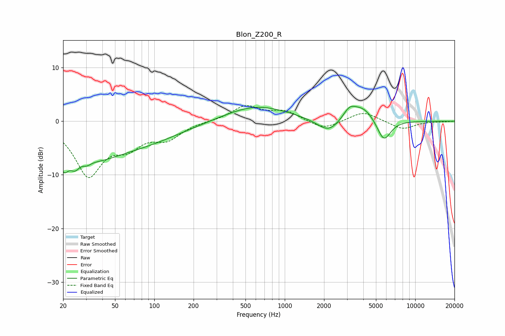

# Blon_Z200_R
See [usage instructions](https://github.com/jaakkopasanen/AutoEq#usage) for more options and info.

### Parametric EQs
Apply preamp of -2.9 dB when using parametric equalizer.

|   # | Type    |   Fc (Hz) |    Q |   Gain (dB) |
|-----|---------|-----------|------|-------------|
|   1 | Peaking |        20 | 3.49 |        -5.1 |
|   2 | Peaking |        25 | 3.7  |        -2.5 |
|   3 | Peaking |        30 | 4.28 |        -0.9 |
|   4 | Peaking |        35 | 0.78 |        -4.4 |
|   5 | Peaking |        76 | 0.45 |        -3.7 |
|   6 | Peaking |       605 | 0.59 |         2.9 |
|   7 | Peaking |      2165 | 1.62 |        -2.6 |
|   8 | Peaking |      3129 | 2.91 |         1.9 |
|   9 | Peaking |      3974 | 1.57 |         2.7 |
|  10 | Peaking |      5743 | 2.58 |        -4.2 |

### Fixed Band EQs
When using fixed band (also called graphic) equalizer, apply preamp of **-3.0 dB** (if available) and set gains manually with these parameters.

|   # | Type    |   Fc (Hz) |    Q |   Gain (dB) |
|-----|---------|-----------|------|-------------|
|   1 | Peaking |        31 | 1.41 |        -9.7 |
|   2 | Peaking |        62 | 1.41 |        -3.7 |
|   3 | Peaking |       125 | 1.41 |        -2.9 |
|   4 | Peaking |       250 | 1.41 |         0   |
|   5 | Peaking |       500 | 1.41 |         2.8 |
|   6 | Peaking |      1000 | 1.41 |         1.8 |
|   7 | Peaking |      2000 | 1.41 |        -1.6 |
|   8 | Peaking |      4000 | 1.41 |         1.9 |
|   9 | Peaking |      8000 | 1.41 |        -1.5 |
|  10 | Peaking |     16000 | 1.41 |        -0.1 |

### Graphs

